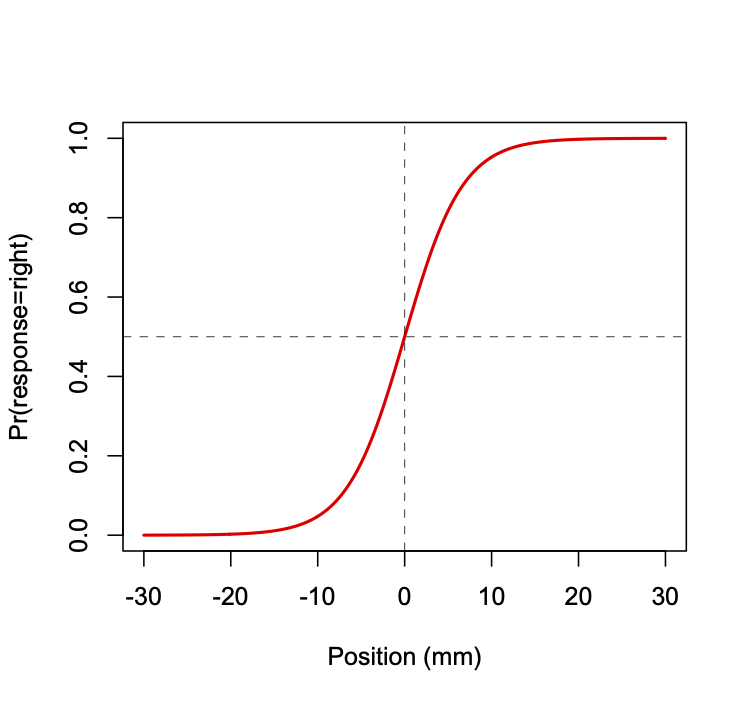

## What is MLE?

Maximum Likelihood Estimation (MLE) is a method for estimating the
parameters of a statistical model given some observed data. The
parameters are the unknown quantities that we want to estimate. For
example, if we have a model that describes the probability of a coin
flip, then the parameter of that model is the probability of a heads
$\theta$. If we have a model that describes the probability of a
gaussian random process, then the parameters are the mean $\mu$ and
standard deviation $\sigma$.

The idea behind MLE is that we want to find the values of the parameters
that make the data that we observed most likely. In other words, we want
to find the values of the parameters that maximize the probability of the
data that we observed.

MLE is a powerful tool for estimating the parameters of a statistical 
model because it is a general method that can be applied to any model
for which you can compute the likelihood function. The only assumptions
of MLE are that the data is independent and identically distributed
(i.i.d.) and that the model is correct. As such it can be used when
the the typical assumptions of parametric statistics (e.g. normality,
homoscedasticity, etc.) are not met.

## Coin Flipping

Assume somebody gives you a coin, and they claim that it is fair, i.e.
the probabilty of a heads is the same as the probability of tails, i.e.
both are 50%. Your task is to observe the behaviour of the coin and then
determine what the probability of heads $\theta$ really is. Is it 50% or
is it something else? (which would reflect a biased coin)

### The Data

You flip the coin 20 times and you observe 12 heads and 8 tails.

### The Model

We must now decide on a model. A convenient model for this case is the
Binomial Distribution, which models a Bernoulli process (a sequence of
binary random responses). The Binomial model is:

$$
y_{i} \sim f(\theta,y_{i}) = \frac{N!}{y_{i}!(N-y_{i})!}\theta^{y_{i}}(1-\theta)^{N-y_{i}}
$$ {#eq-bernoulli}

The model has a single parameter, $\theta$, and that is exactly what we
want to estimate. In maximum likelihood estimation, we determine what
value of the parameter $\theta$ would make the data that we observed
most probable?

### The Likelihood Function

For the Binomial model, there actually exists a closed-form analytic
solution to the maximum likelihood estimate of $\theta$, namely the
number of heads divided by the number of coin flips, or in this case,
12/20 = 0.60. Let's assume however that there isn't a closed form
solution, or that we don't know of one. We will use optimization to find
the value of $\theta$ that maximizes the likelihood of the data that we
observed. To do this we need to compute the likelihood of our data,
given a candidate value (i.e. a guess) for $\theta$.

As we saw in the readings, after some insight into Bayes Theorem, we can
compute the likelihood of a model $\theta$ given data $y$ as:

$$
\mathcal{L}(\theta|y) = p(y|\theta)
$$ {#eq-likelihood}

And we know that for the Binomial distribution,

$$\begin{aligned}
  p(heads|\theta) &= \theta\\
  p(tails|\theta) &= (1-\theta)
\end{aligned}
$$ {#eq-p-heads-tails}

The other trick we need to invoke is that the likelihood of the entire
dataset is the product of the likelihoods of each individual data point
in the dataset.

And finally, because multiplying a bunch of probabilities makes
computers feel icky, we take the logarithm to convert the products into
sums, and so instead of multiplying the likelihood of each observation
in the data set, we add the log-likelihood of each data point.

And finally finally, because optimizers like to minimize things and not
maximize things, we multiply the sum of log-likelihoods by (-1) to get
the negative log likelihood of the dataset:

$$
NLL = - \sum_{i=1}^{N}\log p(y_{i}|\theta)
$$ {#eq-NLL-bernoulli}

So now we can write a function in R to compute the negative log
likelihood of a data vector $y$ given a guess at the parameter $\theta$:

```{python}
import numpy as np

def NLL(theta,y):
    NLL = 0
    N = len(y)
    for i in range(N):
        if y[i]==1:
            p = theta   # heads
        if y[i]==0:
            p = 1-theta # tails
        NLL = NLL + np.log(p)
    return -NLL
```    

Now we can make use of a built-in optimizer in R to find the parameter
value $\theta$ that minimizes the negative log likelihood. Note that one
has to give the optimizer a starting guess at the parameter value, here
I give it a starting guess of 0.5.

```{python}
import scipy as sp

flips = np.array([1,1,1,1,1,1,1,1,1,1,1,1,0,0,0,0,0,0,0,0]) # 12 heads, 8 tails
out = sp.optimize.minimize(NLL, 0.5, args=(flips), method='Nelder-Mead', options={'disp': True})
print(f"\n The MLE estimate of theta is: {out.x[0]:.2f}")
```

And so our best estimate of $\theta$ is 0.6, which matches the known closed-form analytic solution (which is 12 divided by 20 which equals 0.60).

## Normal Distribution

Let's do another example, this time with a model that involves estimating two parameters. Imagine you are handed a dataset comprised of a list of 20 numbers $x_{i}$:

```{python}
x = np.array([85,84,75,93,88,82,85,94,86,76,81,98,95,82,76,91,81,82,72,94])
```

Assume that you want to model these data as coming from a gaussian random process. That is, there is some unknown mean $\mu$ and standard deviation $\sigma$. Thus our model has two unknown parameters.

Now set aside for the moment that we all know full well that there is a closed-form analytic solution to this problem, namely:

$$
\begin{aligned}
\hat{\mu} &= \frac{1}{N}\sum_{i=1}^{N}x_{i}\\
\hat{\sigma} &= \frac{1}{N} \sum_{i=1}^{N}(x_{i}-\hat{\mu})^{2}
\end{aligned}
$$ {#eq-mle-normal}

The point of MLE is to show that as long as you have a forward model of the probability of the data given a guess at the parameter(s), you can use an optimizer to find the parameter value(s) that maximize the likelihood (minimize the negative log-likelihood) of the data given the parameter(s).

We can compute the probability of the data $x$ given parameters $\hat{\mu}$ and $\hat{\sigma}$ using the equation for the normal distribution pdf (probability density function):

$$
p(y|\hat{\mu},\hat{\sigma}) = \frac{1}{\hat{\sigma} \sqrt{2 \pi}}\mathrm{e}^{-\frac{(x-\hat{\mu})^{2}}{2 \hat{\sigma}^{2}}}
$$ {#eq-pdf-normal}

After taking the log and some algebraic manipulation (not shown) we get:

$$
\mathcal{L}(\hat{\mu},\hat{\sigma}|y) = -\frac{N}{2}\log(2\pi) -\frac{N}{2}\log\hat{\sigma}^{2}-\frac{1}{2\hat{\sigma}^{2}}\sum_{i=1}^{N}(x_{i}-\hat{\mu})^{2}
$$ {#eq-likelihood-normal}

Let's put this into a Python function to compute the negative log-likelihood of the data $x$ given parameter guesses $\hat{\mu}$ and $\hat{\sigma}$:

```{python}
def NLL(theta,x):
    mu = theta[0]
    sigma = theta[1]
    N = len(x)
    NLL = -(N/2)*np.log(2*np.pi) - (N/2)*np.log(sigma**2)
    tmp = 0
    for i in range(N):
        tmp = tmp + (x[i]-mu)**2
    NLL = NLL + -(1/(2*(sigma**2)))*tmp
    return -NLL
```


Now we can use an R optimizer to find the parameter values that minimize this function:

```{python}
out = sp.optimize.minimize(NLL, [100,10], args=(x), method='Nelder-Mead', options={'disp': True})
print(f"\nThe MLE estimates of mu and sigma are: {out.x[0]:.2f} and {out.x[1]:.2f}")
```

Note that I still have to give an initial guess at the parameter values
... here I simply guessed `x = [100,10]` which corresponds to an initial guess of
$\hat{\mu}=100$ and $\hat{\sigma}=10$.

So again, the point here is that no matter how complicated our model of
the data is, as long as we can write down the likelihood function (which
amounts to a probability model of how likely different values of data
are, given model parameters), then we can use an optimizer to find the
model parameters that maximize the likelihood of the data.

## A more complex example

Let's say a colleague hands you a coin and you are told that it is fair,
in other words the probability of heads and tails is the same,
$p(\mathrm{heads})=p(\mathrm{tails})=0.5$. You are asked to flip the coin, and each time
give it back to your colleague who will put it in his pocket, and then
take it out again and hand it back to you. You do this 100 times and you
observe the following data:

```{python}
flips = np.array([0, 1, 0, 1, 1, 0, 0, 1, 1, 1, 0, 1, 1, 1, 0, 1, 1, 0, 1, 1, 0, 1,
       0, 0, 1, 1, 0, 1, 0, 1, 1, 0, 1, 0, 1, 1, 0, 1, 0, 1, 1, 1, 1, 1,
       1, 1, 1, 1, 1, 1, 1, 1, 1, 1, 1, 0, 1, 0, 0, 1, 1, 1, 1, 1, 1, 1,
       1, 0, 1, 1, 1, 1, 1, 1, 1, 1, 1, 1, 1, 1, 1, 1, 0, 1, 1, 1, 1, 1,
       1, 1, 1, 1, 1, 0, 1, 1, 1, 1, 1, 1])
```

You are then told that at some point, your colleague **switched the coin**
from the fair coin to an unfair coin with $p(\mathrm{heads})=0.9$. Your task is
to try to estimate **when** the switch occurred, i.e. at what point in the sequence
of 100 coin flips.

Our first question will be, how are we going to model this process?
Clearly like our first example, a Binomial model is appropriate ... but
we also have to model the switching of a coin (when?).

A natural Binomial model might look like this. For trials $1$ to $s$,
$p(\mathrm{heads}) = 0.5$ and for trials $s+1$ to $100$, $p(\mathrm{heads})=0.9$. Now we
have a model of the process that involves the unknown parameter $s$, the
switch trial. Let's write a function in R to compute the negative
log-likelihood given the observed data and a guess at the $s$ parameter:

```{python}
def NLL(s, data):
    n = len(data)
    NLL = 0
    for i in range(n):
        if i <= s:   # still the unbiased coin
            p = 0.5
        else:        # coin has switched to biased coin
            p = 0.9
        if data[i]==1:
            NLL = NLL + np.log(p)
        if data[i]==0:
            NLL = NLL + np.log(1-p)
    return -NLL
```

Now we can optimize:

```{python}
out = sp.optimize.minimize(NLL, 50, args=(flips), method='Nelder-Mead', options={'disp': True})
print(f"\nThe MLE estimate of s is: {int(np.round(out.x[0])):d}")
```

We can see that the best estimate is that $s=39$, trial 39, 
is when the coin switch occurred. In fact this is a very good
estimate, since I generated the data using the following, in which the
flip happened at trial 41:

```{python}
np.random.seed(1234)
flips = np.concatenate((np.random.binomial(1,0.5,40), np.random.binomial(1,0.9,60)))
flips
```

You can imagine extending this example for the case in which you have to
estimate both the time of the coin switch, and the new $p(\mathrm{heads})$.

## Estimating Psychometric Functions

Another example to look at in which MLE is used to estimate a model of
data, is the case of estimating a psychometric function.

A *psychometric function* relates a parameter of a physical stimulus to
an experimental participant's subjective response. In a typical
experiment, some parameter of a stimulus is varied across some range on
each of several trials, and an experimental participant is asked on each
to report their subjective response. For example in an experiment on
visual perception, the experimenter might vary the relative brightness
of two sine-wave gratings, and ask the participant which is brighter,
the one on the left or the one on the right. In an experiment on
auditory perception, the experimenter might vary the first formant
frequency of a synthetic vowel sound along a continuous range, and ask
the participant, do you hear an /i/ or an /a/? These are examples of a
two-alternative-forced-choice (2-AFC) task. What we're interested in is
how the probability of responding with one of the two choices varies
with the stimulus.

Here we will consider the situation where the physical stimulus being
varied is the direction of movement of a participant's (passive) arm,
which is moved by a robotic device to the left or right of the
participant's midline (to varying extents), and the participant's
response is binary (**left** or **right**). This paradigm has been described
in several of our recent papers:

> Wong JD, Wilson ET, Gribble PL (2011) Spatially selective enhancement of proprioceptive acuity following motor learning. J Neurophysiol 105:2512–2521 Available at: [http://dx.doi.org/10.1152/jn.00949.2010](http://dx.doi.org/10.1152/jn.00949.2010).

> Ostry DJ, Darainy M, Mattar AAG, Wong J, Gribble PL (2010) Somatosensory plasticity and motor learning. J Neurosci 30:5384–5393 Available at: [http://dx.doi.org/10.1523/JNEUROSCI.4571-09.2010](http://dx.doi.org/10.1523/JNEUROSCI.4571-09.2010).

### The Logistic Function

We assume the shape of the psychometric function is *logistic*
(see Figure below). The function relates lateral hand position
(relative to a participant's midline) to the probability of the
participant responding that their hand is to the *right* of midline. The
vertical dashed line indicates the hand position at which the
probability of responding *right* is 50%, known as the perceptual
*threshold* (in this case at the actual midline, 0 mm). 

{fig-align="center" height="400px"}

The logistic function is given by the following equation:

$$
p = 1 / \left( 1 + e^{-y} \right)
$$ {#eq-logistic}

where $p = \mathrm{Pr}(\mathrm{right} | x)$.

Here the value of $y$ is a linear function of the lateral hand position
$x$, given by the following equation:

$$
y = \beta_{0} + \beta_{1} x
$$ {#eq-logistic-linear}

where $\beta_{0}$ and $\beta_{1}$ are parameters of the model. The

The shape (steepness) and position (in terms of the threshold) of the
logistic function can be directly related to the parameters $\beta_{0}$
and $\beta_{1}$. Another quantity that we sometimes compute is the
distance between the 75th and 25th percentile (in other words the middle
50 %), as a measure of *acuity*.

$$
\begin{aligned}
    \mathrm{threshold} &= -\beta_{0}/\beta_{1} \\
    \mathrm{slope} &= \beta_{1} / 4 \\
    \mathrm{acuity} &= \mathrm{ilog}(\beta,.75) - \mathrm{ilog}(\beta,.25)
\end{aligned}
$$ {#eq-logistic-params}

where $\mathrm{ilog}(\beta,p)$ is the inverse logistic function:

$$
x = \left[ \log \left( -p / (p - 1) \right) - \beta_{0} \right] / \beta_{1}
$$ {#eq-logistic-inverse}

and as before, $p = \mathrm{Pr}(\mathrm{response}=\mathrm{right} | x)$.

### Maximum Likelihood Estimation

Assume we have empirical data consisting of binary responses $R$
($r_{1}$ through $r_{n}$) (each *left* or *right*) for some number of
hand positions $X$ ($x_{1}$ through $x_{n}$). To estimate a
psychophysical function we need to find the values of $\beta_{0}$ and
$\beta_{1}$ that when run through the logistic function best fit the data.

How do we define a metric for determining "best fit"? Unfortunately we
cannot use a criterion such as *least-squares* combined with standard
linear regression approaches. Using least-squares and a standard linear
model is inappropriate because it violates a number of the assumptions
of linear regression using least-squares. First, the error term would be
*heteroskedastic* which means that the variance of the dependent
variable is not constant across the range of the independent variable.
Second, the error term is not normally distributed, because it is binary
and thus takes on only two possible values. Third, there is no
straightforward way of guaranteeing that predicted probabilities will
not be greater than 1 or less than 0, which of course is not meaningful.

Instead, we will define a new cost function. We will find the values of
$\beta_{0}$ and $\beta{1}$ that maximize the *likelihood of the data*.

Unlike estimation problems like linear regression, in which there is a
closed-form expression for the parameters that minimize a cost function
(e.g. least-squares), in this case using maximum likelihood estimation
(MLE) there is no closed-form solution, and so we must use numerical
optimization to find the parameter values $\beta_{0}$ and $\beta{1}$
that result in the best fit, i.e. that maximize the likelihood of the
data (the set of positions and binary responses) given the model
($\beta_{0}$ and $\beta{1}$).

The probability of an individual binary response $r$, given a hand
position $x$ is given by

$$
\begin{aligned}
    Pr(r = \mathrm{right}|x) &= p\\
    Pr(r = \mathrm{left}|x) &= 1-p
\end{aligned}
$$ {#eq-logistic-prob}


where $p$ depends upon $\beta_{0}$ and $\beta_{1}$ and position $x$ according to @eq-logistic and @eq-logistic-linear above.

The likelihood of the data (all $n$ responses taken together) is
proportional to the product of the probabilities of each response
$r_{i}|x_{i}$:

$$
\mathrm{L}(\mathrm{model}|\mathrm{data}) = \prod_{i=1}^{n}{\mathrm{Pr}(\mathrm{resp}_{i}|x_{i})}
$$ {#eq-logistic-likelihood}

The product of many probabilities (which range from 0 to 1) becomes very
small very quickly, and for large datasets, the likelihood is a very
small number---so small that computers will have difficulties
representing it accurately. To fix this, we take the logarithm, which
has the dual effect of changing small fractions into larger numbers, and
also changing products into sums. So instead of degenerating into a
smaller and smaller fraction, this quantity accumulates into a
manageable-sized number. This is thus the log-likelihood of the data:

$$
\log \left[ \mathrm{L}(\mathrm{model}|\mathrm{data}) \right] = \sum_{i=1}^{n}{\log \left[ \mathrm{Pr}(\mathrm{resp}_{i}|x_{i}) \right]}
$$ {#eq-logistic-loglikelihood}

Finally, since numerical optimizers are set up to find the minimum, not
maximum, of a cost function, we multiply the log-likelihood by $(-1)$.
This gives us a cost function in terms of the *negative log-likelihood*
of the data, given the model.

$$
- \log \left[ \mathrm{L}(\mathrm{model}|\mathrm{data}) \right] = -\sum_{i=1}^{n}{\log \left[ \mathrm{Pr}(\mathrm{resp}_{i}|x_{i}) \right]}
$$ {#eq-logistic-cost}

The equation shown directly above is our cost function. Now given our dataset
(the set of hand positions $x_{i}$ and binary responses $r_{i}$) and a candidate "model"
$(\beta_{0},\beta_{1})$, we can compute the cost, and use numerical
optimization techniques to find the model $(\beta_{0},\beta_{1})$ that
minimizes the cost (the negative log-likelihood of the data).

The table below shows an example of the kind of data we are interested in fitting:

::: {#tab:data}
   x (mm)    response
  --------- ----------
   1.1150      left
   10.2260    right
   -9.2050     left
   5.2180     right
     ...       ...

  : Example data
:::

Typically we represent the response in a numerical format, where 0=left
and 1=right. Also typically we have many more data points than shown,
e.g. in a typical experiment we may test 7 positions each sampled 8
times for a total of 56 observations.

Assume we have an array of hand positions `X` in metres and an array of
binary responses `R` (where left=0 and right=1).

First let's write our logistic function:

```{python}
def logistic(y):
    p = 1/(1+np.exp(-y))
    return p
```


We can write our cost function, called `NLL` as follows:

```{python}
def NLL(B,X,R):
    y = B[0] + B[1]*X
    p = logistic(y)
    NLL = -np.sum(np.log(p[R==1])) - np.sum(np.log(1-p[R==0]))
    return NLL
```

Let's load in some example data and plot it (note I've added some random
scatter along the y-axis to help visualize each individual response). We will also compute mean response as a function of position (since the positions are noisy around 11 distinct values we'll do some clever programming to group them and take averages).

```{python}
import matplotlib.pyplot as plt

url = "files/psychometric_data.txt"

pdata = np.loadtxt(url)
X = pdata[:,0]
R = pdata[:,1]
idx = np.argsort(X)
Xs = X[idx]
Rs = R[idx]
Xr = np.reshape(Xs,(11,14))
Rr = np.reshape(Rs,(11,14))
Xm = np.mean(Xr,axis=1)
Rm = np.mean(Rr,axis=1)
plt.plot(X, R+np.random.randn(len(R))*0.02, 'o', color='blue', alpha=0.25, markersize=5)
plt.plot(Xm,Rm,'rs')
plt.xlabel('X')
plt.ylabel('Response')
plt.grid()
```

You can see that when $X$ is to the far left (negative values), the
response is always $0$, which corresponds to "Left". On the far right,
the response is always $1$, or "Right". In between, the responses
gradually change. In the middle somewhere, responses are about half
"Left" and half "Right".

Now let's use MLE to fit a psychometric function to the data. Again,
note that one has to give the optimizer an initial guess. Here my
initial guess is $(-.1,.1)$.

```{python}
out = sp.optimize.minimize(NLL,[-.1,.1],args=(X,R))
print(f"The MLE estimate of beta is: {out.x}")
```

```{python}
Xp = np.linspace(-20,20,100)
p = logistic(out.x[0] + out.x[1]*Xp)
plt.plot(X, R+np.random.randn(len(R))*0.02, 'o', color='blue', alpha=0.25, markersize=5)
plt.plot(Xm,Rm,'rs')
plt.plot(Xp, p, color='red')
plt.xlabel('X')
plt.ylabel('Response')
plt.grid()
```

You can see that the fitted curve does a very good job of characterizing
how the participant's responses change as the stimulus changes value
from left (negative $X$) to right (positive $X$).


## Hypothesis Testing

### Likelihood Ratio Test

Once we can compute the log-likelihood of our data given a model (a probability distribution and values for the parameters associated with that model) then we can also perform null hypothesis significance testing. Specifically, we can use the **likelihood ratio test** to compare two models of our data.

The test statistic is the ration of the likelihood of the data under a null model to the likelihood of the data under an alternative model. Often the test statistic is expressed as a logarithm, in other words the difference between the two logarithms of the likelihoods. This avoids numerical problems that can arise when the likelihoods are very small or very large.

We can define a test statistic $D$ as shown below. If the null model is true, then the likelihood ratio test statistic will be distributed according to a chi-square distribution with degrees of freedom equal to the difference in the number of parameters between the two models. If the null model is false, then the likelihood ratio test statistic $D$ will be large. The null model is rejected if the likelihood ratio test statistic is larger than the critical value of the chi-square distribution.

$$
D = -2 \left[ \log(p(\mathrm{data}|\mathrm{null})) + \log(p(\mathrm{data}|\mathrm{alternative})) \right]
$$ {#eq-likelihood-ratio-test}

Under the null hypothesis, the test statistic $D$ is distributed according to a chi-square distribution with degrees of freedom equal to the difference in the number of parameters between the two models.

### Illy vs Lavazza

In the slides for this week we saw an example dataset in which my lab tested me on my ability to discriminate between two different brands of coffee. They gave me 20 cups of coffee (10 Illy and 10 Lavazza) in random order and for each I had to say whether the coffee was made using Illy beans or using Lavazza beans.

The data were that 16 times I was correct and 4 times I was incorrect.

The experiment can be modelled as 20 Bernoulli trials. We know the probability density function for a Bernoulli process is the Binomial distribution, which has two parameters: $n$ (number of trials) and $w$ (probabilty of success on any given trial).

The Binomial distribution gives the probability of observing $y$ successes in $n$ trials, given a probability of success $w$ on each trial. Thus our Likelihood function is:

$$
L(w|y,n) = \frac{n!}{y!(n-y)!} w^y (1-w)^{n-y}
$$ {#eq-binomial}

What model explains the data? This is equivalent to asking, what is the value of parameter $w$? If it near 1.0 then I have a very good ability to discriminate between Illy and Lavazza. If it is near 0.5 then basically I have no ability, I am performing no differently than someone who is randomly guessing.

When we performed MLE (in the slides) we found that the MLE estimate of $w$ was 0.8. We also saw that there is in fact an analytic solution for the MLE estimate of $w$ in a Binomial distribution, which is simply:

$$
\hat{w} = \frac{y}{n}
$$

which is also $w=0.8$.

### Testing against a null model

But now we want to perform a hypothesis test against a null model in which $w=0.5$. We can do this using the likelihood ratio test.

Using @eq-binomial above we can compute the likelihood of the data under the MLE model in which $w=0.8$, and under the null hypothesis model in which $w=0.5$. We can then compute the $D$ statistic, and compute a p-value using the chi-square distribution with 1 degree of freedom (because the difference in the number of parameters between the two models is 1).

```{python}
from math import factorial
import numpy as np
def binomial_likelihood(w, y, n):
    return (factorial(n)/(factorial(y)*factorial(n-y))) * ((w**y)*((1-w)**(n-y)))

LL_mle = np.log(binomial_likelihood(0.8, 16, 20))
LL_null = np.log(binomial_likelihood(0.5, 16, 20))
D = -2 * (LL_null - LL_mle)
pvalue = 1 - sp.stats.chi2.cdf(D, 1)
print(f"D({1}) = {D:.2f}, p-value = {pvalue:.5f}")
```

Thus we can reject the null hypothesis at a p-value of 0.00549. This means that we can conclude that a model with a $w$ parameter of $0.8$ better explains the observed data than a model with $w=0.5$.


## Readings

- [Myung2003.pdf](../files/Myung2003.pdf)
- [Matt Golder: MLE](../files/matt_golder_mle.pdf)
- [John Myles White: MLE in R](http://www.johnmyleswhite.com/notebook/2010/04/21/doing-maximum-likelihood-estimation-by-hand-in-r/)

## Slides

- [MLE_slides.pdf](../files/MLE_slides.pdf)


