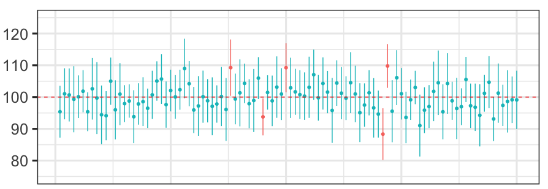

We will look at two topics related to resampling methods: (1) estimating population parameters using the bootstrap, and (2) performing null hypothesis tests using permutation tests.

## Estimating Population Parameters

Usually our scientific questions are about populations, but we cannot measure the entire population. Instead we take a random sample of the population and use information about the sample to infer information about the population. This is called inference.

If we take a random sample of size N=10 from a population, the best estimate of the population mean is the mean of the sample.

What is the precision of this estimate? We know it relates to the sample size. The larger the sample size the more precise the estimate.

### Parametric approach: SEM

In the **parametric** approach, we assume that the population is normally distributed. We use the standard deviation of the sample, and the sample size, to compute the *standard error of the mean*, which is an estimate (a *parametric* estimate) of the standard deviation of the sampling distribution of means. The standard error of the mean is thus an estimate of the precision of the sample mean as an estimate of the population mean. The standard error of the mean $SEM$ is given by:

$$SEM = \frac{s}{\sqrt{N}}$$

where $s$ is the standard deviation of our sample, and $N$ is the sample size. Notice how the sample size affects the SEM. The larger the sample size, the smaller the SEM.

### The 95% confidence interval

We can use the SEM to calculate the *confidence interval* of our estimate of the population mean. The 95% confidence interval is given by:

$$\bar{y} \pm t_{(.975,N-1)} \left( SEM \right)$$

where $\bar{y}$ is the sample mean, and $t_{.975,N-1}$ is the critical value of the $t$ statistic for a 95% confidence interval, $N$ is the sample size, and $SEM$ is the standard error of the mean.

So when we perform one experiment, and collect one sample, we can not only produce an estimate of the population mean (the mean of our sample) we can also produce, assuming the population is normally distributed, metrics corresponding to the precision of our estimate of the population mean (the SEM, the 95% confidence interval). This is useful information to have when we interpret the estimate of the population mean, especially if we are comparing estimates of population means of two samples (e.g. placebo vs. drug).

What is the meaning of the 95% confidence interval? We want to say it's the interval that we are 95% sure contains the true population value---but this is incorrect.

The correct interpretation of the 95% confidence interval is as follows: If we were to take many random samples of size N from the population, and for each sample compute the mean plus or minus the 95% confidence interval, then 95% of those confidence intervals would contain the true population mean. Of course this means 5% of the intervals would not. Which ones? We don't know. And of course usually we have only sampled once from the population (we do our experiment once).

In the image below, the vertical lines indicated 95% confidence intervals of 100 repeated samples and the dots indicate sample means. The horizontal dashed line indicates the true (unknown) population mean. Of the 100 confidence intervals, 95 intervals (light blue lines) contain the true population mean and 5 do not (red lines). 

{width=80%}


### Non-parametric approach: Bootstrapping

What happens if we cannot assume that the population is normally distributed?

Before we answer this question, let's ask another question---how likely is this to occur? In fact there are many examples of variables we are interested in measuring, that are not normally distributed. Strictly speaking, any variable that cannot take on a negative value is not normally distributed. Many variables follow a log-normal distribution, e.g. reaction times; e.g. size of living tissue (length, weight); e.g. number of hospitalized cases of COVID-19; and many others (see the [Wikipedia page](https://en.wikipedia.org/wiki/Log-normal_distribution) for a list of examples). Many variables follow a [Poisson distribution](https://en.wikipedia.org/wiki/Poisson_distribution), e.g. inter-spike-intervals of neurons. 

If the population is not normally distributed, we cannot use the SEM to calculate the precision of our estimate of the population mean. We need to use a *non-parametric* approach. We can use the **bootstrap** to estimate the standard deviation of the sampling distribution of means.

In the bootstrap we generate, through simulation, an *empirical sampling distribution of means*. We can no longer rely on a formula such as shown above, to calculate metrics corresponding to the precision of our estimate of the population mean. Instead what we do in the bootstrap is generate, through simulation, an *empirical sampling distribution of means*. In essence we simulate repeating our experiment again and again, (e.g. 10,000 times) and each time we compute a sample mean. We can then look at the distribution of sample means, and use this distribution to estimate the precision of our estimate of the population mean (e.g. by taking the standard deviation of the empirical sampling distribution of means).

How do we simulate repeating our experiment 10,000 times? We only have one sample! How do we take new samples from the population without actually collecting new data? The trick in the boostrap is that we do this by sampling *with replacement* from our sample. We use our sample as a proxy for the population. We repeatedly (10,000 times) take samples of size N from our sample. The *with replacement* part means that each observation in our sample may be taken more than once (and by extension, some observations in our sample may be left unsampled). If we resampled our original sample without replacement, we would just end up with 10,000 exact copies of our original sample. That would not be very useful.

Of course the validity of this approach rests on the assumption that our sample is a reasonable proxy for the population ... and in the usual way, the larger (and more random) the sample, the more this is true.

### Bootstrap code

Let's say we performed an experiment measuring reaction times (RTs) and collected a sample of 20 RTs. We can use the bootstrap to estimate the standard deviation of the sampling distribution of means.

So what we are going to do is repeatedly (10,000 times) take samples of size N , *with replacement*, from our sample. We then calculate the mean of each sample and store it in an array.

Here is our sample of size N=20 RTs, which were drawn from a log-normal distribution (not a normal distribution).

```{python}
import numpy as np
import matplotlib.pyplot as plt

RTs_sample = np.array([500,650,650,750,1200,800,650,1000,750,1400,700,900,900,1300,850,950,750,850,1050,900])

print(f"Sample mean is {np.mean(RTs_sample):.2f} ms")

plt.hist(RTs_sample)
plt.show()
```

Now what we will do is repeatedly sample, 10,000 times, with replacement, from our original sample of N=20 RTs, each time producing a new sample of size N=20. We will compute the mean of each of these bootstrap samples, and store it in an array.

```{python}
np.random.seed(9040)
nboot = 10000
RTs_boot_means = np.zeros(nboot)
N = len(RTs_sample)
for i in range(nboot):
    RTs_boot_sample = np.random.choice(RTs_sample, size=N, replace=True)
    RTs_boot_means[i] = np.mean(RTs_boot_sample)
```

Now we can look at the distribution of bootstrap sample means:

```{python}
plt.hist(RTs_boot_means, bins=np.array(np.arange(600,1200,10)))
plt.show()
```

**Question**: why does the distribution of the sample means look like a normal distribution? I thought we were sampling from a non-normal distribution?

**Answer**: The *Central Limit Theorem* says that the sampling distribution looks more and more like a normal distribution as the sample size increases, even if the population from which the samples were drawn is not normally distributed.

We can compute the mean of the bootstrap sample means, which is an estimate of the mean of the true sampling distribution of means from the population:

```{python}
RTs_boot_means_mean = np.mean(RTs_boot_means)
print(f"mean of bootstrap sample means is {RTs_boot_means_mean:.2f}")
```

This is very close to our sample mean, which is not surprising.

Now we can compute the standard deviation of the bootstrap sample means, which is an estimate of the standard deviation of the true sampling distribution of means from the population:

```{python}
RTs_boot_means_std = np.std(RTs_boot_means)
print(f"sd of bootstrap sample means is {RTs_boot_means_std:.2f}")
```

We can also compute a 95% confidence interval for the mean of the population by simply picking off values from the boostrap sample we generated. We have 10,000 bootstrap sample means in our empirical sampling distribution of means. We know 95% of 10,000 is 9500. If we sort our bootstrap means, we can simply pick the 250th and 9,750th values. These are the 2.5th and 97.5th percentiles of the bootstrap sample means. The these two values represent our 95% confidence interval for the mean of the population.

```{python}
RTs_boot_means_sorted = np.sort(RTs_boot_means)
RTs_boot_means_95CI = RTs_boot_means_sorted[[250,9750]]
print(f"95% confidence interval for the mean of the population is ({RTs_boot_means_95CI[0]:.1f}, {RTs_boot_means_95CI[1]:.1f})")
```

Below we overlay the mean and 95% confidence interval on the histogram of bootstrap sample means:

```{python}
#| code-fold: true
plt.hist(RTs_boot_means, bins=np.array(np.arange(600,1200,10)))
plt.axvline(x=RTs_boot_means_mean, color="red")
plt.axvline(x=RTs_boot_means_95CI[0], color="red", linestyle="--")
plt.axvline(x=RTs_boot_means_95CI[1], color="red", linestyle="--")
plt.show()
```

If we had done this all using the parametric approach, we would have violated the assumption that the population is normally distributed. The consequence of this violation would be that our confidence interval would be incorrect.

The bootstrap approach is very powerful because it allows us to estimate the precision of our estimate of the population mean, even if we cannot assume that the population is normally distributed.

### scipy.stats.bootstrap()

The SciPy package has a bootstrap function called [`scipy.stats.bootstrap()`](https://docs.scipy.org/doc/scipy/reference/generated/scipy.stats.bootstrap.html#scipy-stats-bootstrap) which will do the same thing as our code above (and it has some other options as well):

```{python}
import scipy as sp
np.random.seed(9040)
boot_out = sp.stats.bootstrap([RTs_sample], np.mean, n_resamples=10000, method='percentile')
ci95 = boot_out.confidence_interval
print(f"95% confidence interval for the mean of the population is ({ci95[0]:.1f}, {ci95[1]:.1f})")
```

### BCa bootstrap

It turns out that for data with some features, the basic "percentile method" described above for determining the 95% confidence limits in a bootstrap can be improved upon. The "BCa" method, which stands for "accelerated bias-corrected", is a way to adjust the percentile limits to take into account these "second-order" effects. For details see:

> Efron B. (1987), "Better bootstrap confidence intervals", *Journal of the American Statistical Society*, 82, 171-200. [http://dx.doi.org/10.2307/2289144](http://dx.doi.org/10.2307/2289144)

Also see this book on bootstraps more generally:

> Efron B, Tibshirani R, Tibshirani RJ (1994) An introduction to the bootstrap. Philadelphia, PA: Chapman & Hall/CRC. [http://dx.doi.org/10.1201/9780429246593/introduction-bootstrap-bradley-efron-tibshirani](http://dx.doi.org/10.1201/9780429246593/introduction-bootstrap-bradley-efron-tibshirani)

In Python we can use the `scipy.stats.bootstrap()` function with the argument `method='BCa'` to implement this correction:

```{python}
import scipy as sp
np.random.seed(9040)
boot_out = sp.stats.bootstrap([RTs_sample], np.mean, n_resamples=10000, method='BCa')
ci95 = boot_out.confidence_interval
print(f"95% confidence interval for the mean of the population is ({ci95[0]:.1f}, {ci95[1]:.1f})")
```

In fact `'BCa'` is the default `method=` option for `scipy.stats.boostrap()`.

## Null hypothesis statistical testing

When we perform an experiment to test the effect of an experimental manipulation on the mean of a dependent variable, we take two random samples and apply the manipulation, then perform a statistical test on the means of the two samples to compute a p-value. If the p-value is less than our chosen alpha level, we reject the null hypothesis that the two samples were drawn from the same population.

### Parametric approach: t-test

If we perform an independent samples t-test for example, we compute a t-statistic which takes into account both the difference between means, the variance of the samples, and the sample size N (formula not shown here).

From the t-statistic we compute a p-value which tells the probability of observing a t-statistic (i.e. a difference between means) this big or bigger, under the null hypothesis in which both samples were taken from the same population.

Here is an example:

```{python}
np.random.seed(9040)
y1 = np.random.normal(0.5, 1, 15) # mean = 0.5, sd = 1
y2 = np.random.normal(0.0, 1, 15) # mean = 0.0, sd = 1
print(f"The mean of the first sample is {np.mean(y1):.3f}")
print(f"The mean of the second sample is {np.mean(y2):.3f}")
```

```{python}
import scipy as sp
out = sp.stats.ttest_ind(y1, y2, alternative='greater') # one-tailed t-test
print(f"The t-statistic is {out.statistic:.3f}")
print(f"The p-value is {out.pvalue:.3f}")
```

The calculations underlying the t-test rest on the assumption that the population(s) are normally distributed with equal variance. If this assumption is violated, the t-test will not be valid (the computed p-value will not be an accurate estimate of the probability of observing a difference between means this big or bigger under the null hypothesis).

### Non-parametric approach: permutation test

If the normality assumption is violated, we can use a *permutation test* to compute a p-value. The permutation test is a non-parametric approach to statistical testing. It does not rely on any assumptions about the distribution of the data. In this way it is a very powerful approach.

The only assumption of the permutation test is the *assumption of exchangeability*. This means that if the null hypothesis is true, then any data point that appears in one of our groups is just as likely to have appeared in the other group. This implies that each observation is independent of the other observations. In some complex experimental designs, and/or with some kinds of data, this assumption may not be true, and it may require some careful consideration to determine what parts of the data are exchangeable under the null hypothesis.

The idea behind the permutation test is to simulate the null hypothesis. We assume the null hypothesis is true, and that the data we have in hand for each group was sampled from the same population. We then simulate repeating our experiment, many times (e.g. 10,000 times), each time taking two new random samples from the population and computing the difference between means. We then compute the proportion of times the difference between means is as big or bigger than the difference between means we observed in our actual experiment. This proportion is our p-value.

How do we simulate sampling from "the population" when all we have in hand is the two samples we collected? The idea is that if the null hypothesis is true, then the two samples we collected are just two random samples from the same population. So we can simulate sampling from "the population" by randomly shuffling the data from both samples together, and then taking two new random samples from the shuffled data.

We can do this many times (e.g. 10,000 times), and each time we will get two new random samples from the same "population" (which is simply both real samples pooled together).

### Permutation test code

First let's compute the observed difference between means of our experimental samples:

```{python}
meandiff_obs = np.mean(y1) - np.mean(y2)
print(f"The observed difference between means is {meandiff_obs:.3f}")
```

Now let's perform a permutation test to estimate the probability we could have observed a difference between means this big or bigger under the null hypothesis that both samples were drawn from the same population:

```{python}
np.random.seed(9040)
nboot = 10000
meandiffs_sim = np.zeros(nboot)
N1 = len(y1)
N2 = len(y2)
pooled = np.concatenate((y1,y2)) # put both samples in one big array
for i in range(nboot):
    np.random.shuffle(pooled) # shuffle the data
    y1_sim = pooled[:N1] # take the first N1 elements as the first sample
    y2_sim = pooled[N1:] # take the last N2 elements as the second sample
    meandiffs_sim[i] = np.mean(y1_sim) - np.mean(y2_sim) # compute the difference between means
```

Now we can look at the distribution of the simulated differences between means:

```{python}
plt.hist(meandiffs_sim, bins=np.array(np.arange(-2,2,.1)))
plt.axvline(x=meandiff_obs, color="red")
plt.xlim(-2,2)
plt.show()
```

We can see the distribution of the simulated differences between means is centered around 0, which is what we would expect if the null hypothesis were true. The red line indicates the difference between means we observed in our actual experiment.

Now to compute a p-value we can simply count the number of times the simulated difference between means was as big or bigger than the observed difference between means (the number of simulated outcomes to the right of the red line in the Figure above), and divide by the number of simulations:

```{python}
pval = np.sum(meandiffs_sim >= meandiff_obs) / nboot # one-tailed test
print(f"The p-value is {pval:.3f}")
```

### scipy.stats.permutation_test()

The SciPy package has a permutation test function called `scipy.stats.permutation_test()`. But our own code above is not that complex and the advantage of writing our own code is that we can understand exactly what is going on (and modify it as needed). Nevertheless here's how we could use it.

First we have to define a Python function that takes in data and outputs our statistic of interest. In this case our statistic of interest is the difference in means between our two groups:

```{python}
def mystat(x,y):
    return np.mean(x)-np.mean(y)
```

Now we can call `scipy.stats.permutation_test()`:

```{python}
results = sp.stats.permutation_test(data=[y1,y2], statistic=mystat, n_resamples=10000, alternative="greater")
print(f"statistic={results.statistic:.3f}, p={results.pvalue:.3f}")
plt.hist(results.null_distribution, bins=np.array(np.arange(-2,2,.1)))
plt.axvline(results.statistic, color="red")
plt.xlim(-2,2)
plt.show()
```

## Cross-validation

Cross-validation is a technique for estimating the performance of a statistical learning or curve fitting method. It is also widely used as a method to control for the **overfitting** problem.

The overfitting problem is a common problem in statistical learning and curve fitting. It occurs when the data are fit too closely, which on the one hand minimizes the error of the fit (which is a good thing) but on the other hand results in a model or curve fit that performs very poorly on new data.

### Overfitting example

Here are some (x,y) data that we are interested in modeling so that we can make predictions in the future:

```{python}
import numpy as np
# import warnings
# warnings.simplefilter('ignore', np.RankWarning)
import matplotlib.pyplot as plt

x = np.arange(0,10,1)
y = np.array([-3.08, -0.90, -1.34, -3.10, -4.08, -4.24, -6.02, -3.87, -.25, 3.55])
plt.plot(x,y,'ro')
```

We are going to fit a polynomial curve to the data using the `np.polyfit()` function. The `np.polyfit()` function takes as input the x and y data, and the degree of the polynomial to fit. It returns the coefficients of the polynomial.

Let's fit polynomials of degree 0, 1, 2, 3, 4, 5, 6, 7, 8, and 9 to the data, and for each compute sum of squared error between the predicted values of y and the actual values of y:

```{python}
p_coefs = []
SSE = np.zeros(10)
for i,deg in enumerate(range(0,10)):
    p = np.polyfit(x,y,deg)
    p_coefs.append(p)
    yhat = np.polyval(p,x)
    SSE[i] = np.sum((yhat-y)**2)
```

Now let's plot the data and the polynomial fits:

```{python}
#| code-fold: true
fig,ax = plt.subplots(2,5,figsize=(8, 4))
xi = np.linspace(-2,12,100)
for i,p in enumerate(p_coefs):
    plt.subplot(2, 5, i+1)
    plt.plot(x, y, 'ro')
    yi = np.polyval(p, xi)
    plt.plot(xi, yi, 'b-')
    plt.xlim((-2,12))
    plt.ylim((-8,8))
    plt.title(f"deg={i}, SSE={SSE[i]:.3f}", fontsize = 10)
    plt.tight_layout()
```

What you see in the Figure above is as the degree of the polynomial increases, the fit of the curve (in blue) to the data (in red) gets better and better. Shouldn't we use the polynomial associated with the best fit, i.e. the polynomial of degree 9?

At some point the fit gets so good that it starts to **overfit** the data. In other words, the curve fit is so good that it starts to fit the noise in the data, and it starts to perform very poorly on *new data*.

### Leave-one-out cross-validation

How do we identify when overfitting is occurring if we do not have any new data? We can simulate this by leaving one data point out when we fit the model and then testing the model fit not on the data that was used to fit the model but on the data point that was left out. In this way the data point that was left out is a simulation of new data.

We repeat this "leave-one-out" cross-validation procedure for each data point in the dataset. In this way each data point gets to be the "new data" once. We can then compute the average sum of squared error across all the "leave-one-out" cross-validation procedures.

```{python} 
#| warning: false
n = len(x)
SSE_cv = np.zeros(10)
for i in range(n):
    x_train = np.delete(x,i)
    y_train = np.delete(y,i)
    x_test = x[i]
    y_test = y[i]
    p_coefs = []
    for ix,deg in enumerate(range(0,10)):
        p = np.polyfit(x_train,y_train,deg)
        p_coefs.append(p)
        yhat = np.polyval(p,x_test)
        SSE_cv[ix] += np.sum((yhat-y_test)**2)
SSE_cv = SSE_cv / n
```

Now let's plot `SSE_cv`, evaluated on the left-one-out datapoints, as a function of the degree of the polynomial. We will take the square root of SSE so that we can better see the difference between the SSE values for the different polynomial fits:

```{python}
#| warning: false
#| code-fold: true
fig,ax = plt.subplots()
ax.plot(range(0,10),np.sqrt(SSE_cv),'bo-')
ax.set_xlabel("degree of polynomial")
ax.set_ylabel("sqrt(SSE) (left-one-out)")
ax2 = ax.twinx()
ax2.plot(range(0,10),np.sqrt(SSE),'ro-')
ax2.set_ylabel("sqrt(SSE) (full dataset)")
fig.legend(("left-one-out","full dataset"), loc="center")
fig.tight_layout()
```

What we can clearly see is that while the SSE for the full dataset decreases monotonically as the degree of polynomial (the complexity of the model) increases, the SSE for the left-one-out data does not. Let's plot `SSE_cv` on its own to better see what is going on. We will also plot using a logarithmic scale on the y-axis just so we can better see the pattern:

```{python}
#| warning: false
#| code-fold: true
fig,ax = plt.subplots()
sse_plot = ax.semilogy(range(0,10),np.sqrt(SSE_cv),'bo-')
ax.semilogy(4,np.sqrt(SSE_cv[4]),'ro', markersize=15, markerfacecolor='none')
ax.set_xlabel("degree of polynomial")
ax.set_ylabel("sqrt(SSE) (left-one-out)")
ax.legend(sse_plot, ("left-one-out",""), loc="best")
fig.tight_layout()
```

What we can clearly see is a non-monotonic relationship between polynomial degree and cross-validated SSE. In fact, it is clear that the polynomial of degree 4 is the best fit to the left-one-out data (circled in red in the Figure above). The SSE is lowest for the polynomial of degree 4, and the SSE for the polynomial of degree 4 is significantly lower than the SSE for the polynomial of degree 9.

This is despite the fact that the SSE on the original (fit) dataset for polynomial 4 was not the lowest SSE. Polynomials of degree 5,6,7,8, and 9 produced better fits to the original dataset ... but they **overfit** the data and performed poorly on the left-one-out data.

### K-fold cross-validation

Cross-validation can also be done using a leave-N-out approach in which N data points are left out of the fit and used to test the fit. This is called **N-fold cross-validation**.

### Assumptions of cross-validation

Cross-validation is a very powerful technique for controlling overfitting in all kinds of contexts from curve fitting, to machine learning, to statistical inference. It relies only on the assumption that the data are independent and identically distributed (i.i.d.).


## Other Resources

- [Permutation test using Alpacas](https://www.jwilber.me/permutationtest/)
- [Resampling Methods: A practical guide to data analysis](https://link.springer.com/book/10.1007/0-8176-4444-X) by Phillip I. Good
- [Cross-validation](https://en.wikipedia.org/wiki/Cross-validation_(statistics)) (Wikipedia)

