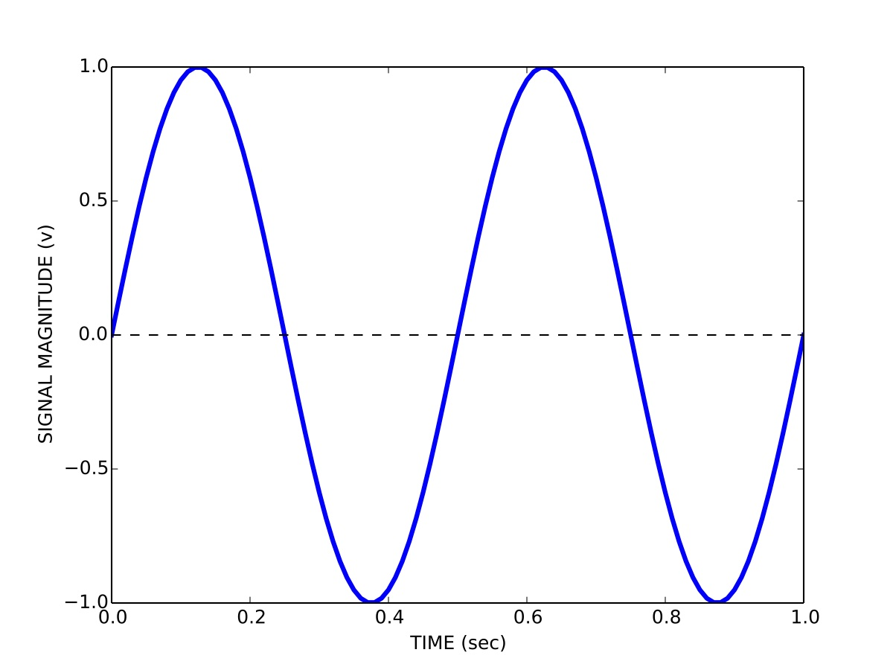
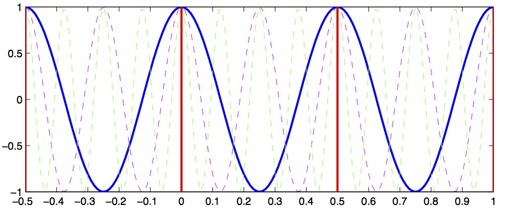
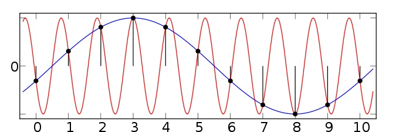
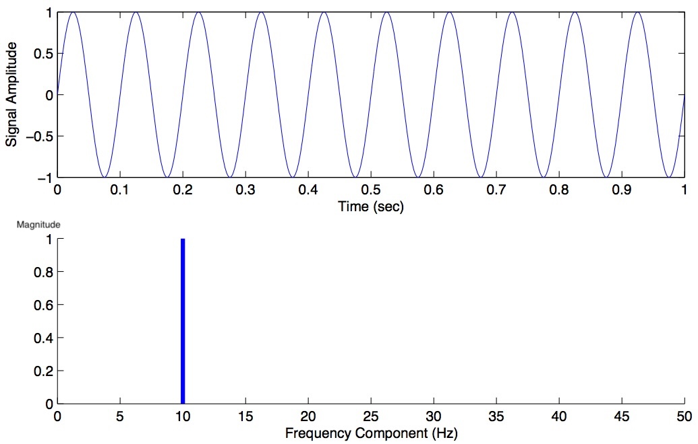
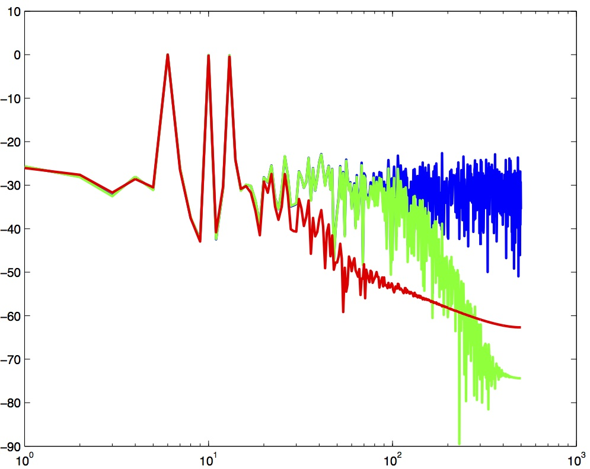
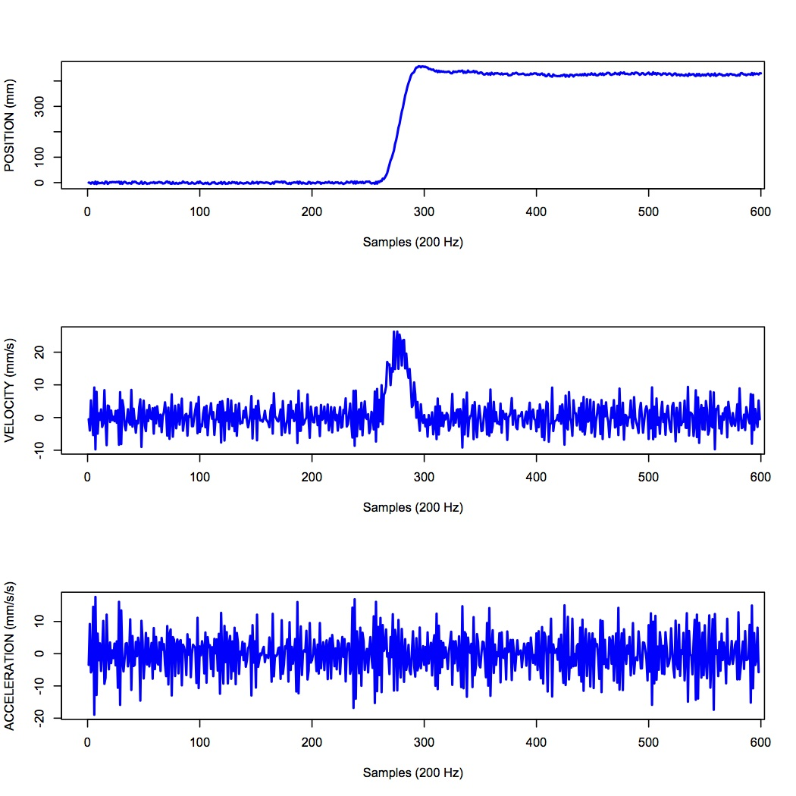
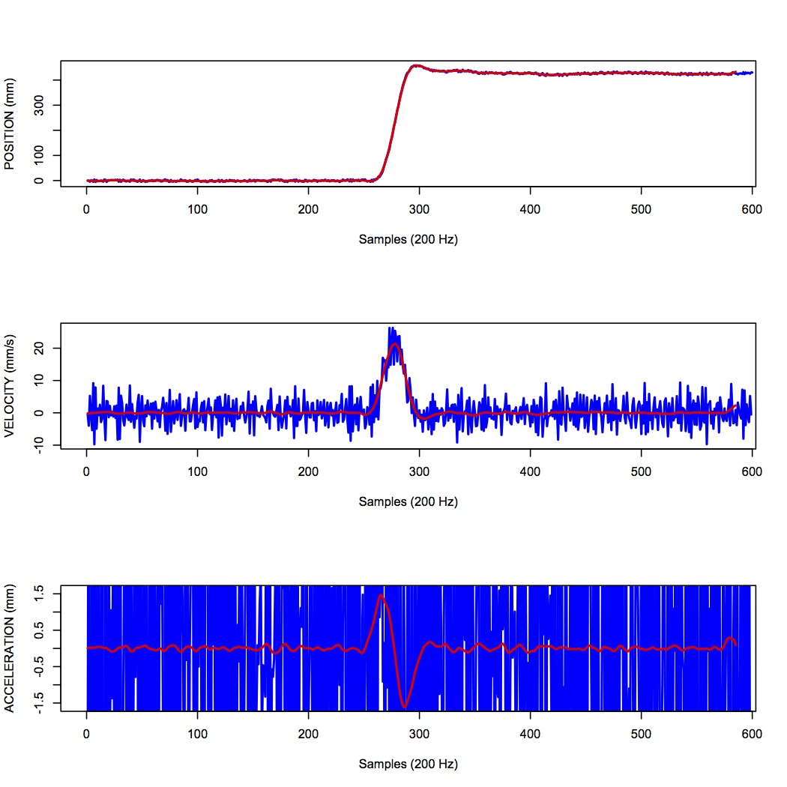
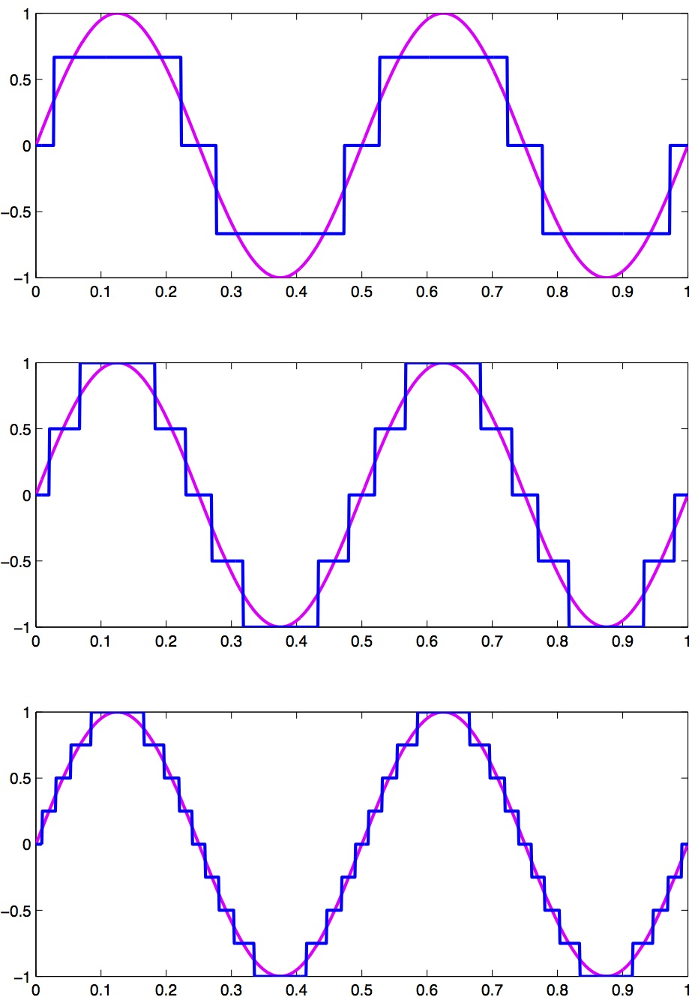

# Signals, Sampling, & Filtering

Whereas signals in nature (such as sound waves, magnetic fields, hand position, electromyograms (EMG), electroencephalograms (EEG), extra-cellular potentials, etc) vary continuously, often in science we measure these signals by *sampling* them repeatedly over time, at some *sampling frequency*. The resulting collection of measurements is a *discretized* representation of the original continuous signal.

These concepts come up constantly in neuroscience and psychology research. If you record EEG, you will need to understand frequency bands (alpha, beta, gamma) and how to filter out line noise. If you record movement data, you will need to low-pass filter before taking derivatives to get velocity and acceleration. If you record EMG, you will need to understand the frequency content of muscle signals versus noise. This chapter covers the foundational tools for all of these tasks.

Before we get into *sampling theory* however we should first talk about how signals can be represented both in the *time domain* and in the *frequency domain*.

Jack Schaedler has a nice page explaining and visualizing many concepts discussed in this chapter:

[Seeing circles, sines and signals](https://jackschaedler.github.io/circles-sines-signals/index.html)

## Time domain representation of signals

This is how you are probably used to thinking about signals, namely how the magnitude of a signal varies over time. So for example a signal $s$ containing a sinusoid with a period $T$ of 0.5 seconds (a frequency of 2 Hz) and a peak-to-peak magnitude $b$ of 2 volts is represented in the time domain $t$ as:

$$s(t) = \left(\frac{b}{2}\right) \mathrm{sin}\left(wt\right)$$

where

$$w = \frac{2 \pi}{T}$$

We can visualize the signal by plotting its magnitude as a function of time, as shown in Figure [1](#fig:timedomainsignal){reference-type="ref" reference="fig:timedomainsignal"}.

{#fig:timedomainsignal width=60%}

## Frequency domain representation of signals

We can also represent signals in the frequency domain. This requires some understanding of the [Fourier series](http://en.wikipedia.org/wiki/Fourier_series). The idea of the Fourier series is that all periodic signals can be represented by (decomposed into) the sum of a set of pure sines and cosines that differ in frequency and period. See the wikipedia link for lots of details and a helpful animation.

$$s(t) = \frac{a_{0}}{2} + \sum_{n=1}^{\infty} \left[a_{n}\mathrm{cos}(nwt) + b_{n}\mathrm{sin}(nwt)\right]$$

The coefficients $a_{n}$ and $b_{n}$ define the weighting of the different sines and cosines at different frequencies. In other words these coefficients represent the strength of the different frequency components in the signal.

We can also represent the Fourier series using only cosines:

$$s(t) = \frac{a_{0}}{2} + \sum_{n=1}^{\infty} \left[r_{n}\mathrm{cos}(nwt-\phi_{n})\right]$$

Using this formulation we now have *magnitude* coefficients $r_{n}$ and *phase* coefficients $\phi_{n}$. That is, we are representing the original signal $s(t)$ using a sum of sinusoids of different frequencies and phases.

Here is a web page that lets you play with how sines and cosines can be used to represent different signals: [Fourier series visualization](https://www.jezzamon.com/fourier/).

Here is another that lets you manipulate sines and cosines, play them as sounds, and manipulate the spectrum directly: [Fourier series applet](https://www.falstad.com/fourier/).

## Fast Fourier transform (FFT)

Given a signal there is a very efficient computational algorithm called the [Fast Fourier transform](http://en.wikipedia.org/wiki/Fast_Fourier_transform) (FFT) for computing the magnitude and phase coefficients. We will not go into the details of this algorithm here, most high level programming languages have a library that includes the FFT algorithm.

Here is a video showing a 100-year-old mechanical computer that does both forward and inverse Fourier transforms:

-   [Harmonic Analyzer (1/4)](https://youtu.be/NAsM30MAHLg)
-   [Harmonic Analyzer (2/4)](https://www.youtube.com/watch?v=8KmVDxkia_w)
-   [Harmonic Analyzer (3/4)](https://www.youtube.com/watch?v=6dW6VYXp9HM)
-   [Harmonic Analyzer (4/4)](https://www.youtube.com/watch?v=jfH-NbsmvD4)

## Sampling

Before we talk about the FFT and magnitude and phase coefficients, we need to talk about discrete versus continuous signals, and sampling. In theory we can derive a mathematical description of the Fourier decomposition of a continuous signal, as we have done above, in terms of an infinite number of sinusoids. In practice however, signals are not continuous, but are *sampled* at some discrete *sampling rate*.

For example, when we use Optotrak to record the position of the fingertip during pointing experiments, we choose a sampling rate of 200 Hz. This means 200 times per second the measurement instrument samples and records the position of the fingertip. The interval between any two samples is 5 ms. It turns out that the sampling rate used has a specific effect on the number of frequencies used in a discrete Fourier representation of the recorded signals.

The [Nyquist-Shannon sampling theorem](https://en.wikipedia.org/wiki/Nyquist-Shannon_sampling_theorem) states that a signal must be sampled at a rate which is at least twice that of its highest frequency component. If a signal contains power at frequencies higher than half the sampling rate, these high frequency components will appear in the sampled data at lower frequencies and will distort the recording. This is known as the problem of [aliasing](http://en.wikipedia.org/wiki/Aliasing).

Let's look at a concrete example that will illustrate this concept. Let's assume we have a signal that we want to sample, and we choose a sampling rate of 4 Hz. This means every 250 ms we sample the signal. According to the Shannon-Nyquist theorem, the maximum frequency we can uniquely identify is half that, which is 2 Hz. This is called the [nyquist frequency](http://en.wikipedia.org/wiki/Nyquist_frequency). Let's look at a plot and see why this is so.

In Figure [2](#fig:signalaliasing){reference-type="ref" reference="fig:signalaliasing"} we see a solid blue line showing a 2 Hz signal, a magenta dashed line showing a 4 Hz signal, and a green dashed line showing a 8 Hz signal. Now imagine we sample these signals at 2 Hz, indicated by the vertical red lines. Notice that at the sample points (vertical red lines), the 2 Hz, 4 Hz and 8 Hz signals overlap with identical values. This means that on the basis of our 2 Hz samples, we cannot distinguish between frequencies of 2, 4 and 8 Hz. What's more, what this means is that if the signal we are actually sampling at 2 Hz has significant signal power at frequencies above the Nyquist (1 Hz) then the power at these higher frequencies will influence our estimates of the magnitude coefficients corresponding to frequencies below the Nyquist\... in other words the high-frequency power will be aliased into the lower frequency estimates.

{#fig:signalaliasing width=60%}

Figure [3](#fig:signalaliasingsines){reference-type="ref" reference="fig:signalaliasingsines"} shows another example taken from the [wikipedia article on aliasing](http://en.wikipedia.org/wiki/Aliasing). Here we have two sinusoids---one at 0.1 Hz (blue) and another at 0.9 Hz (red). We sample both at a sampling rate of 1 Hz (vertical green lines). You can see that at the sample points, both the 0.1 Hz and 0.9 Hz sinusoids pass through the sample points and thus both would influence our estimates of the power at the 0.1 Hz frequency. Since the sampling rate is 1 Hz, the Nyquist frequency (the maximum frequency we can distinguish) is 0.5 Hz---and so any power in the signal above 0.5 Hz (such as 0.9 Hz) will be aliased down into the lower frequencies (in this case into the 0.1 Hz band).

{#fig:signalaliasingsines width=60%}

So the message here is that in advance, before choosing your sampling rate, you should have some knowledge about the highest frequency that you (a) are interested in identifying; and (b) you think is a real component in the signal (as opposed to random noise). In cases where you have no a priori knowledge about the expected frequency content, one strategy is to remove high frequency components *before sampling*. This can be accomplished using low-pass filtering---sometimes called anti-aliasing filters. Once the signal has been sampled, it's too late to perform anti-aliasing.

## Spectrum

Having bypassed completely the computational details of how magnitude and phase coefficients are estimated, we will now talk about how to interpret them.

For a given signal, the collection of magnitude coefficients gives a description of the signal in terms of the strength of the various underlying frequency components. For our immediate purposes these magnitude coefficients will be most important to us and we can for the moment set aside the phase coefficients.

Here is an example of a magnitude spectrum for a pure 10 Hz signal, sampled at 100 Hz.

{#fig:signalspectrum10 width=60%}

The magnitude values are zero for every frequency except 10 Hz. We haven't plotted the phase coefficients. The set of magnitude and phase coefficients derived from a Fourier analysis is a complete description of the underlying signal, with one caveat---only frequencies up to the Nyquist are represented. So the idea here is that one can go between the original time-domain representation of the signal and this frequency domain representation of the signal without losing information. As we shall see below in the section on filtering, we can perform operations in the frequency domain and then transform back into the time domain.

### Python code for Spectrum

Here is some Python code to illustrate these concepts. We construct a one second signal sampled at 1000 Hz that is composed of a 6 Hz, 10 Hz and 13 Hz component. We then use the `scipy.fft.rfft()` function from the SciPy package to compute the Fast Fourier transform, we extract the magnitude information, we set our frequency range (up to the Nyquist) and we plot the spectrum, which is shown below.

```{python}
import numpy as np
import scipy as sp
import matplotlib.pyplot as plt

fs = 1000  # sampling rate in Hz
t = np.arange(0, 1, 1/fs)  # 1 second sampled at 1000 Hz
y = np.sin(2*np.pi*t*6) + np.sin(2*np.pi*t*10) + np.sin(2*np.pi*t*13) # 6 Hz, 10 Hz and 13 Hz components

fig,ax = plt.subplots(2,1)
ax[0].plot(t,y)
ax[0].set_xlabel('Time (sec)')
ax[0].set_ylabel('Signal Amplitude')
 
out = sp.fft.rfft(y) # compute the FFT (rfft is fft on real-valued data and is preferred for speed)
mag = np.abs(out)    # extract the magnitude information
freqs = sp.fft.rfftfreq(len(y), d=1/fs) # compute the frequency range

ax[1].plot(freqs, mag) # plot the magnitude spectrum up to the Nyquist
ax[1].set_xlim([0,50]) # let's zoom in on the first 50 Hz 
ax[1].set_xlabel('Frequency Component (Hz)')
ax[1].set_ylabel('Amplitude')

plt.tight_layout()
```

We can see that the spectrum has revealed peaks at 6, 10 and 13 Hz---which we know is correct, since we designed our signal from scratch.

Typically however signals in the real world that we record are not pure sinusoids, but contain random noise. Noise can originate from the actual underlying process that we are interested in measuring, and it can also originate from the instruments we use to measure the signal. For noisy signals, the FFT taken across the whole signal can be noisy as well, and can make it difficult to see peaks. This motivates the use of *power spectral density* estimation methods.

## Power Spectral Density

One solution is instead of performing the FFT on the entire signal all at once, to instead, split the signal into chunks, take the FFT of each chunk, and then average these spectra to come up with a smoother spectrum. This can be accomplished using a [power spectral density](https://en.wikipedia.org/wiki/Spectral_density) function. In Python in the SciPy package there is a function [`scipy.signal.welch()`](https://docs.scipy.org/doc/scipy/reference/generated/scipy.signal.welch.html#scipy.signal.welch) to accomplish this. We won't go into the mathematical details or the theoretical considerations (relating to stochastic processes) but for now suffice it to say that the psd can often give you a better estimate of the power at different frequencies compared to a "plain" FFT, in the presence of random noise.

### Python code for power spectral density

To see why PSD estimation matters, consider a signal that looks more like real neural data. Real EEG, for example, has a characteristic 1/f background (more power at lower frequencies) with broad bumps at specific frequency bands---it does *not* consist of sharp sinusoidal peaks. A periodogram of such a signal is wildly jagged, and the broad spectral features that neuroscientists care about (alpha, beta, etc.) are completely hidden in the noise. The Welch PSD averages out that noise and reveals the underlying spectral shape.

Here we simulate 30 seconds of EEG-like data with a 1/f background, an alpha band (~8--12 Hz), and a beta band (~20--30 Hz):

```{python}
np.random.seed(42)
fs = 256                            # typical EEG sampling rate
duration = 30                       # 30 seconds of data
t_eeg = np.arange(0, duration, 1/fs)
N_eeg = len(t_eeg)

# 1/f (pink noise) background — common in neural signals
white = np.random.randn(N_eeg)
freqs_shape = np.fft.rfftfreq(N_eeg, d=1/fs)
freqs_shape[0] = 1                  # avoid division by zero
spectrum_shaped = np.fft.rfft(white) / np.sqrt(freqs_shape)
pink = np.fft.irfft(spectrum_shaped, n=N_eeg)
pink = pink / np.std(pink) * 8      # scale to ~8 µV RMS

# Helper to create a narrowband signal (like a real EEG oscillation)
def make_band(t, fc, bw, fs, amp):
    """Filter white noise into a narrow frequency band."""
    n = np.random.randn(len(t))
    lo = max((fc - bw/2) / (fs/2), 0.002)
    hi = min((fc + bw/2) / (fs/2), 0.998)
    b, a = sp.signal.butter(3, [lo, hi], btype='bandpass')
    out = sp.signal.filtfilt(b, a, n)
    return amp * out / np.std(out)

alpha = make_band(t_eeg, 10, 4, fs, 5)    # alpha: 8–12 Hz, ~5 µV
beta  = make_band(t_eeg, 25, 8, fs, 3)    # beta: 21–29 Hz, ~3 µV
eeg = pink + alpha + beta + np.random.randn(N_eeg) * 3

# --- Periodogram vs Welch ---
freqs_p, psd_p = sp.signal.periodogram(eeg, fs=fs)
freqs_w, psd_w = sp.signal.welch(eeg, fs=fs, nperseg=2*fs)

fig, axes = plt.subplots(3, 1, figsize=(8,6))

axes[0].plot(t_eeg[t_eeg < 3], eeg[t_eeg < 3], linewidth=0.5)
axes[0].set_xlabel('Time (sec)')
axes[0].set_ylabel('Amplitude (µV)')
axes[0].set_title('Simulated EEG signal (30 sec recorded, first 3 sec shown)')

axes[1].semilogy(freqs_p[1:], psd_p[1:], linewidth=0.3)
axes[1].set_xlim([0, 60])
axes[1].set_xlabel('Frequency (Hz)')
axes[1].set_ylabel('µV²/Hz')
axes[1].set_title('Periodogram — noisy at every frequency, broad features invisible')

axes[2].semilogy(freqs_w[1:], psd_w[1:], linewidth=2, color='C1')
axes[2].set_xlim([0, 60])
axes[2].set_xlabel('Frequency (Hz)')
axes[2].set_ylabel('µV²/Hz')
axes[2].set_title('Welch PSD — 1/f slope, alpha (~10 Hz) and beta (~25 Hz) bumps clearly visible')

# Match y-axis limits so the panels are directly comparable
ymin = 5e-2
ymax = 2e+1
axes[1].set_ylim([ymin, ymax])
axes[2].set_ylim([ymin, ymax])

plt.tight_layout()
```

The periodogram (middle panel) is a jagged mess---you can see the general downward 1/f trend if you squint, but you cannot identify the alpha or beta bumps at all. Random noise spikes are just as tall as any real spectral feature. The Welch PSD (bottom panel) averages over many overlapping 2-second segments, producing a smooth curve where the 1/f background, the alpha peak around 10 Hz, and the beta peak around 25 Hz are all immediately visible.

::: {.callout-note}
If you tried this with pure sinusoids instead of broadband signals, the periodogram would actually look fine---a sine wave concentrates all its power into a single sharp FFT bin, which towers above the noise. The Welch PSD really proves its worth on signals with *broad* spectral features, which is exactly what real biological data looks like.
:::

### Multitaper PSD

It turns out that Welch's method, while good, can be improved upon. Welch's method works by splitting the signal into overlapping segments, windowing each segment (typically with a Hann window), computing the FFT of each, and averaging. This averaging reduces variance compared to a raw FFT, but there is a fundamental trade-off: shorter segments give smoother spectra (more segments to average) but poorer frequency resolution (fewer frequency bins per segment). Additionally, any single window shape emphasizes some frequencies and suppresses others---a phenomenon called **spectral leakage**.

The Thomson [multitaper method](https://en.wikipedia.org/wiki/Multitaper) takes a different approach. Instead of splitting the signal into chunks and using one window per chunk, it keeps the full signal intact and applies *multiple different windows* (called **tapers**) to the same data. Each taper produces a slightly different spectral estimate, and these are averaged together.

The tapers used---called **Discrete Prolate Spheroidal Sequences (DPSS)** or **Slepian sequences**---are mathematically optimal: they maximize energy concentration within a specified frequency bandwidth. Because each taper is orthogonal to the others, each tapered estimate provides genuinely independent information about the spectrum. The result is a spectral estimate with lower variance and reduced leakage compared to Welch's method, without sacrificing frequency resolution.

The main parameter you choose is the **time-bandwidth product** (commonly called NW). A typical value is NW = 4, which gives 2×NW − 1 = 7 usable tapers. Higher NW means more tapers (lower variance) but broader frequency smoothing (lower resolution). In practice you control this via a `bandwidth` parameter in Hz rather than setting NW directly.

### Python code for multitaper PSD

The [MNE-Python](https://mne.tools/) package (install with `pip install mne`) provides a multitaper function that works just like `scipy.signal.welch()`---one line in, PSD out:

```{python}
from mne.time_frequency import psd_array_multitaper
```

Here we compare Welch and multitaper on a signal with two close frequency components (10 Hz and 14 Hz, only 4 Hz apart) buried in noise. With only 2 seconds of data, Welch must use short segments and therefore has limited frequency resolution. The multitaper method uses the full signal with multiple tapers, giving it both good resolution and a smooth estimate:

```{python}
np.random.seed(42)

fs = 1000
t = np.arange(0, 2, 1/fs)  # 2 seconds of data
y = np.sin(2*np.pi*10*t) + 0.8*np.sin(2*np.pi*14*t)
yn = y + np.random.randn(len(t)) * 2

fig, ax = plt.subplots(2, 1, figsize=(8, 6))

ax[0].plot(t, yn, linewidth=0.5)
ax[0].set_xlabel('Time (sec)')
ax[0].set_ylabel('Amplitude')
ax[0].set_title('Noisy signal — 2 sec of data (10 Hz + 14 Hz, 4 Hz apart)')

# Welch PSD — short segments mean poor frequency resolution
freqs_welch, psd_welch = sp.signal.welch(yn, fs=fs, nperseg=250)

# Multitaper PSD — one line, uses the full 2-second signal
psd_mt, freqs_mt = psd_array_multitaper(yn, sfreq=fs, bandwidth=2.0,
                                         normalization='full', verbose=False)

ax[1].plot(freqs_welch, psd_welch, linewidth=2, label='Welch PSD (nperseg=250, 4 Hz resolution)')
ax[1].plot(freqs_mt, psd_mt, linewidth=2, label='Multitaper PSD (bandwidth=2 Hz)')
ax[1].set_xlim([0, 40])
ax[1].set_xlabel('Frequency (Hz)')
ax[1].set_ylabel('Power / Frequency (V²/Hz)')
ax[1].set_title('Welch vs. Multitaper — can you resolve the two peaks?')
ax[1].legend()
plt.tight_layout()
```

The Welch estimate (blue) sees only a single broad hump around 10--14 Hz---it cannot resolve the two peaks because its frequency resolution (4 Hz) is equal to the gap between them. The multitaper estimate (orange) clearly separates the 10 Hz and 14 Hz components, because it uses the full 2-second signal and therefore has finer frequency resolution (0.5 Hz bins, smoothed over a 2 Hz bandwidth).

The `bandwidth` parameter (in Hz) controls the frequency smoothing---it plays the same role as the time-bandwidth product NW (specifically, bandwidth = 2 × NW / T, where T is the signal duration in seconds). Setting `normalization='full'` ensures the output is in the same V²/Hz units as `scipy.signal.welch()`, so you can overlay them directly.

::: {.callout-tip collapse="true"}
## Under the hood: what `psd_array_multitaper` is doing

If you want to understand (or implement) multitaper yourself, here is what the function does step by step using only SciPy. You don't need to run this---it produces the same result as the one-liner above.

```python
NW = 2                         # time-bandwidth product
K = 2 * NW - 1                 # number of tapers (3)
N = len(yn)
dpss_tapers, eigvals = sp.signal.windows.dpss(N, NW, Kmax=K, return_ratios=True)

tapered_spectra = np.zeros((K, N // 2 + 1))
for i in range(K):
    tapered_signal = yn * dpss_tapers[i]
    fft_result = sp.fft.rfft(tapered_signal)
    tapered_spectra[i] = np.abs(fft_result) ** 2

# Average with eigenvalue weighting and normalize to PSD units (V²/Hz)
weights = eigvals[:, np.newaxis]
psd_mt = 2 * np.sum(weights * tapered_spectra, axis=0) / (fs * np.sum(weights))
psd_mt[0] /= 2   # no doubling for DC
psd_mt[-1] /= 2   # no doubling for Nyquist
freqs_mt = sp.fft.rfftfreq(N, d=1/fs)
```

Each DPSS taper is a window function that is orthogonal to the others and maximally concentrates energy within the chosen bandwidth. Multiplying the signal by each taper, taking the FFT, and averaging gives a smooth spectral estimate without splitting the data into short segments.
:::

## Decibel scale

The decibel (dB) scale is a ratio scale. It is commonly used to measure sound level but is also widely used in electronics and signal processing. The dB is a logarithmic unit used to describe a ratio. You will often see power spectra displayed in units of decibels.

### Amplitude versus Power

Before we define dB, it's important to understand the distinction between *amplitude* and *power*, since this determines which dB formula you use.

**Amplitude** is what you measure directly with your instrument: a voltage from an EEG electrode, a pressure level from a microphone, or a displacement from a position sensor. It is the "raw" signal value at any point in time.

**Power** is proportional to the *square* of amplitude. For an electrical signal, the instantaneous power dissipated by a resistance $R$ is $P = V^{2}/R$. For sound, intensity (power per unit area) is proportional to the square of pressure. Physically, power captures the *energy* being delivered per unit time; squaring the amplitude reflects the fact that pushing twice as hard (doubling the amplitude) requires four times the energy (quadrupling the power).

When you compute an FFT, `np.abs(fft_result)` gives you the *amplitude* (magnitude) of each frequency component. When you *square* those magnitudes (or use `scipy.signal.welch()`, which returns power spectral density), you are working in *power* units.

### The dB formulas

The difference between two **power** levels is defined to be:

$$10 \times \left[\mathrm{log}_{10}\left(\frac{P_{2}}{P_{1}}\right)\right] \text{ dB}$$

Thus when $P_{2}$ is twice as large as $P_{1}$, then the difference is about 3 dB. When $P_{2}$ is 10 times as large as $P_{1}$, the difference is 10 dB. A 100 times difference is 20 dB.

For **amplitude** (voltage, pressure) ratios, the formula uses a factor of 20 instead of 10:

$$20 \times \left[\mathrm{log}_{10}\left(\frac{A_{2}}{A_{1}}\right)\right] \text{ dB}$$

These two formulas are consistent with each other because power is proportional to amplitude squared: $10 \times \mathrm{log}_{10}(A^{2}_{2}/A^{2}_{1}) = 20 \times \mathrm{log}_{10}(A_{2}/A_{1})$. Either way, doubling the amplitude corresponds to a ~6 dB increase, while doubling the power corresponds to a ~3 dB increase.

**In practice**: when converting a Welch PSD to decibels, use `10 * np.log10(psd)` because Welch returns power. If you are working with raw FFT magnitudes (amplitudes) and want dB, use `20 * np.log10(mag)`. Mixing these up is a common source of confusion.

### Which convention is used where?

Different subfields tend to use amplitude or power by convention. A few examples relevant to neuroscience and psychology:

-   **EEG/MEG**: power is dominant. "Alpha power" means squared amplitude in the 8--12 Hz band, reported in µV²/Hz. This is because the questions are usually about *energy* in a frequency band. Use `10 * np.log10()`.

-   **EMG**: power spectra for frequency-domain analyses (e.g. median frequency as a fatigue metric), but root-mean-square (RMS) *amplitude* in volts for time-domain analyses.

-   **Acoustics**: sound pressure level (SPL) is an *amplitude* measure---defined as $20 \times \mathrm{log}_{10}(p/p_{ref})$ dB where $p_{ref}$ = 20 µPa. Audiograms use this convention.

-   **Kinematics / motion capture**: position, velocity, and acceleration are amplitude measures (mm, mm/s, mm/s²), but clinical tremor analysis often uses *power* spectral density to quantify energy in the tremor band.

-   **fMRI**: the BOLD signal is reported as percent signal change (amplitude). Frequency-domain fMRI measures like ALFF (amplitude of low-frequency fluctuations) also use the amplitude convention despite involving FFTs.

The quick check: if the y-axis units are squared (µV², Pa², etc.), it's power---use `10 * log10()`. If not (µV, Pa, mm/s), it's amplitude---use `20 * log10()`.

An advantage of using the dB scale is that it is easier to see small signal components in the presence of large ones. In other words large components don't visually swamp small ones.

Since the dB scale is a ratio scale, to compute absolute levels one needs a reference---a zero point. In acoustics this reference is usually 20 micropascals---about the limit of sensitivity of the human ear.

For our purposes in the absence of a meaningful reference we can use 1.0
as the reference (i.e. as $P_{1}$ in the above equation).

## Spectrogram
 
Often there are times when you may want to examine how the power spectrum of a signal (in other words its frequency content) changes over time. In speech acoustics for example, at certain frequencies, bands of energy called [formants](http://en.wikipedia.org/wiki/Formant) may be identified, and are associated with certain speech sounds like vowels and vowel transitions. It is thought that the neural systems for human speech recognition are tuned for identification of these formants.

Essentially a spectrogram is a way to visualize a series of power spectra computed from slices of a signal over time. Imagine a series of single power spectra (frequency versus power) repeated over time and stacked next to each other over a time axis.

The SciPy package has a function called [`scipy.signal.spectrogram()`](https://docs.scipy.org/doc/scipy/reference/generated/scipy.signal.spectrogram.html#scipy.signal.spectrogram) that will generate a spectrogram.

Here we generate a 100 Hz signal within noise, sampled at 2000 Hz, and we add a transient "chirp" of a 400 Hz signal partway through.

```{python}
dt = 0.0005
time = np.arange(0.0, 20.0, dt)
s1 = np.sin(2 * np.pi * 100 * time)
s2 = 2 * np.sin(2 * np.pi * 400 * time)
s2[time <= 10] = 0   # zero out before 10 sec
s2[time >= 12] = 0   # zero out after 12 sec (chirp only between 10-12 sec)
nse = 0.01 * np.random.random(size=len(time)) # add some noise into the mix
x = s1 + s2 + nse  # the signal
fig,ax = plt.subplots(2,1, figsize=(6,6))
ax[0].plot(time, x)
ax[0].set_xlabel('Time [sec]')
ax[0].set_ylabel('Signal Amplitude')
f, t_spec, Sxx = sp.signal.spectrogram(x, fs=1/dt, nfft=1024)
ax[1].pcolormesh(t_spec, f, Sxx)
ax[1].set_xlabel('Time [sec]')
ax[1].set_ylabel('Frequency [Hz]')
plt.tight_layout()
```

The Matplotlib package also has a function called [`matplotlib.pyplot.specgram()`](https://matplotlib.org/api/_as_gen/matplotlib.pyplot.specgram.html) that will generate a spectrogram.


## Filtering

The Fourier series representation and its computational implementation, the FFT and the PSD, are useful not only for determining what frequency components are present in a signal, but we can also perform operations within frequency space in order to manipulate the strength of different frequency components in the signal. This can be especially effective for eliminating noise sources with known frequency content.

Let's look at a concrete example, a spectrum of a noisy signal with peaks at 10, 50 and 200 Hz.

```{python}
fs = 1000
t = np.arange(0, 1, 1/fs)
y = np.sin(2*np.pi*t*10) + np.sin(2*np.pi*t*50) + np.sin(2*np.pi*t*200)
yn = y + np.random.randn(len(y))*0.5
freqs,psd = sp.signal.welch(yn, fs=fs, nperseg=1000)
plt.plot(freqs,psd)
plt.xlabel('Frequency (Hz)')
plt.ylabel('Power / Frequency')
plt.tight_layout()
```

In the Figure above we can see the signal has three signal components: 10, 50 and 200 Hz. Let's say we believe that the frequencies we are interested in are all below 100 Hz. In other words, frequencies above that are assumed to be noise of one sort or another. We can filter the signal so that all frequencies above 100 Hz are essentially zeroed out (or at least reduced in magnitude). One way to do this is simply to take the vector of power coefficients, change all values for frequencies above 100 Hz to zero, and perform an inverse Fourier transform (the inverse of the FFT) to go back to the time domain. We won't go into the mathematical details, but there are also other ways to filter a signal as well.

Here is a short summary of different kinds of filters, and some
terminology.

-   *low-pass filters* pass low frequencies without change, but
    attenuate (i.e. reduce) frequencies above the *cutoff frequency*

-   *high-pass filters* pass high frequencies and attenuate low
    frequencies, below the cutoff frequency

-   *band-pass filters* pass frequencies within a *pass band* frequency
    range and attenuate all others

-   *band-stop filters* (sometimes called *band-reject filters* or
    *notch filters*) attenuate frequencies within the *stop band* and
    pass all others

### Characterizing filter performance

A useful way of characterizing a filter's performance is in terms of the ratio of the amplitude of the output to the input (the amplitude ratio AR or gain), and the phase shift ($\phi$) between the input and output, as functions of frequency. A plot of the amplitude ratio and phase shift against frequency is called a [Bode plot](http://en.wikipedia.org/wiki/Bode_plot).

The *pass band* of a filter is the range of frequencies over which signals pass with no change. The *stop band* refers to the range of frequencies over which a filter attenuates signals. The *cutoff frequency* or *corner frequency* of a filter is used to describe the transition point from the pass band to the reject band. This this transition cannot occur instantaneously it is usually defined to be the point at which the filter output is equal to -3 dB of the input in the pass band. The cutoff frequency is sometimes called the -3 dB point or the half-power point since -3 dB corresponds to half the signal power. The *roll-off* refers to the rate at which the filter attenuates the input after the cutoff point. When the roll-off is linear it can be specified as a specific slope, e.g. in terms of dB/decade or dB/octave (an octave is a doubling in frequency).

Let's look at some examples of filter characteristics.

{#fig:signal_bode width=60%}

In the Figure above the blue trace shows the power spectrum for the unfiltered signal. The red trace shows a lowpass-filtered version of the signal with a cutoff frequency of 30 Hz. The green trace shows a low-pass with a cutoff frequency of 130 Hz. Also notice that the roll-off of the 30 Hz lowpass is not as great as for the 130 Hz lowpass, which has a higher roll-off.

### Python code for filtering

Here is a function in Python to do low-pass filtering using a Butterworth filter. Note that we use `filtfilt` rather than `lfilter`---`filtfilt` applies the filter forward and then backward, resulting in zero phase distortion. A single-pass filter (`lfilter`) would shift the signal in time, which is undesirable when you need to preserve the temporal alignment of events (e.g. stimulus onsets, movement onsets, etc).

```{python}
def plg_lowpass(y, samprate, cutoff, order=2):
    w = cutoff / (samprate / 2) # Normalize the cutoff frequency
    b, a = sp.signal.butter(N=order, Wn=w, btype='lowpass') # get the filter coefficients
    yf = sp.signal.filtfilt(b, a, y) # perform the filtering
    return yf
```

One for high-pass filtering:

```{python}
def plg_highpass(y, samprate, cutoff, order=2):
    w = cutoff / (samprate / 2) # Normalize the cutoff frequency
    b, a = sp.signal.butter(N=order, Wn=w, btype='highpass') # get the filter coefficients
    yf = sp.signal.filtfilt(b, a, y) # perform the filtering
    return yf
```

One for band-pass filtering and band-stop filtering:

```{python}
def plg_bandpass(y, samprate, cutoffs, order=2):
    cutoffs = np.array(cutoffs)
    w = cutoffs / (samprate / 2) # Normalize the cutoff frequencies
    b, a = sp.signal.butter(N=order, Wn=w, btype='bandpass') # get the filter coefficients
    yf = sp.signal.filtfilt(b, a, y) # perform the filtering
    return yf
```


```{python}
def plg_bandstop(y, samprate, cutoffs, order=2):
    cutoffs = np.array(cutoffs)
    w = cutoffs / (samprate / 2) # Normalize the cutoff frequencies
    b, a = sp.signal.butter(N=order, Wn=w, btype='bandstop') # get the filter coefficients
    yf = sp.signal.filtfilt(b, a, y) # perform the filtering
    return yf
```

You can download a Python file containing all 4 filter functions above here: [plg_filters.py](code/plg_filters.py)

Here we demo the four types of filters by using them to filter broadband noise:

```{python}
fs = 1000
t = np.arange(0, 10, 1/fs)
y = np.random.randn(len(t))
freqs,psd = sp.signal.welch(y,fs=fs,nperseg=100)
fig,ax = plt.subplots(2,1, figsize=(6,6))
ax[0].plot(t,y)
ax[0].set_xlabel('Time (s)')
ax[0].set_ylabel('Amplitude')
ax[0].set_title('Unfiltered noise')
ax[1].plot(freqs,psd)
ax[1].set_xlabel('Frequency (Hz)')
ax[1].set_ylabel('Power Spectral Density')
ax[1].set_title('Power spectrum of unfiltered noise')
ax[1].grid()
plt.tight_layout()
```

```{python}
yf = plg_lowpass(y, fs, 200) # low-pass filter at 200 Hz
freqs,psd = sp.signal.welch(yf,fs=fs,nperseg=100)
fig,ax = plt.subplots(2,1, figsize=(6,6))
ax[0].plot(t,yf)
ax[0].set_xlabel('Time (s)')
ax[0].set_ylabel('Amplitude')
ax[0].set_title('Low-passed at 200 Hz')
ax[1].plot(freqs,psd)
ax[1].set_xlabel('Frequency (Hz)')
ax[1].set_ylabel('Power Spectral Density')
ax[1].set_title('Power spectrum of low-passed noise')
ax[1].grid()
plt.tight_layout()
```

```{python}
yf = plg_highpass(y, fs, 200) # high-pass filter at 200 Hz
freqs,psd = sp.signal.welch(yf,fs=fs,nperseg=100)
fig,ax = plt.subplots(2,1, figsize=(6,6))
ax[0].plot(t,yf)
ax[0].set_xlabel('Time (s)')
ax[0].set_ylabel('Amplitude')
ax[0].set_title('High-passed at 200 Hz')
ax[1].plot(freqs,psd)
ax[1].set_xlabel('Frequency (Hz)')
ax[1].set_ylabel('Power Spectral Density')
ax[1].set_title('Power spectrum of high-passed noise')
ax[1].grid()
plt.tight_layout()
```

```{python}
yf = plg_bandpass(y, fs, [200,300]) # band-pass filter at 200-300 Hz
freqs,psd = sp.signal.welch(yf,fs=fs,nperseg=100)
fig,ax = plt.subplots(2,1, figsize=(6,6))
ax[0].plot(t,yf)
ax[0].set_xlabel('Time (s)')
ax[0].set_ylabel('Amplitude')
ax[0].set_title('Band-passed at 200-300 Hz')
ax[1].plot(freqs,psd)
ax[1].set_xlabel('Frequency (Hz)')
ax[1].set_ylabel('Power Spectral Density')
ax[1].set_title('Power spectrum of band-passed noise')
ax[1].grid()
plt.tight_layout()
```

```{python}
yf = plg_bandstop(y, fs, [200,300]) # band-stop filter at 200-300 Hz
freqs,psd = sp.signal.welch(yf,fs=fs,nperseg=100)
fig,ax = plt.subplots(2,1, figsize=(6,6))
ax[0].plot(t,yf)
ax[0].set_xlabel('Time (s)')
ax[0].set_ylabel('Amplitude')
ax[0].set_title('Band-stopped at 200-300 Hz')
ax[1].plot(freqs,10*np.log10(psd))
ax[1].set_xlabel('Frequency (Hz)')
ax[1].set_ylabel('Power Spectral Density (dB)')
ax[1].set_title('Power spectrum of band-stopped noise (dB scale)')
ax[1].grid()
plt.tight_layout()
```

Note: `filtfilt` can occasionally produce small artifacts at the very beginning and end of a signal, especially for short signals or signals with transients at the edges. For most practical purposes this is not a problem, but it's worth being aware of.

### Common Filters

There are many different designs of filters, each with their own characteristics (gain, phase and delay characteristics). Some common types:

-   *Butterworth Filters* have frequency responses which are maximally
    flat and have a monotonic roll-off. They are well behaved and this
    makes them very popular choices for simple filtering applications.
    For example in my work I use them exclusively for filtering
    physiological signals.

-   *Tschebyschev Filters* provide a steeper monotonic roll-off, but at
    the expense of some ripple (oscillatory noise) in the pass-band.

-   *Cauer Filters* provide a sharper roll-off still, but at the expense
    of ripple in both the pass-band and the stop-band, and reduced
    stop-band attenuation.

-   *Bessel Filters* have a phase-shift which is linear with frequency
    in the pass-band. This corresponds to a pure delay and so Bessel
    filters preserve the shape of the signal quite well. The roll-off
    is monotonic and approaches the same slope as the Butterworth and
    Tschebyschev filters at high frequencies although it has a more
    gentle roll-off near the corner frequency.

### Filter order

In [filter design](http://en.wikipedia.org/wiki/Filter_design) the *order* of a filter is one characteristic that you might come across. Technically the definition of the filter order is the highest exponent in the [z-domain](http://en.wikipedia.org/wiki/Z-transform) ([transfer function](http://en.wikipedia.org/wiki/Transfer_function)) of a [digital filter](http://en.wikipedia.org/wiki/Digital_filter). That's helpful isn't it! (not) Another way of describing filter order is the degree of the approximating polynomial for the filter. Yet another way of describing it is that increasing the filter order increases roll-off and brings the filter closer to the ideal response (i.e. a "brick wall" roll-off).

Practically speaking, you will find that a second-order butterworth filter provides a nice sharp roll-off without too much undesirable side-effects (e.g. large time lag, ripple in the pass-band, etc).

See [this section](http://en.wikipedia.org/wiki/Low-pass_filter#Continuous-time_low-pass_filters) of the wikipedia page on low-pass filters for another description.

### High-frequency noise and taking derivatives

One of the characteristics of just about any experimental measurement is
that the signal that you measure with your instrument will contain a
combination of true signal and "noise" (random variations in the
signal). A common approach is to take many measurements and average them
together. This is what is commonly done in EEG/ERP studies, in EMG
studies, with spike-triggered averaging, and many others. The idea is
that if the "real" part of the signal is constant over trials, and the
"noise" part of the signal is random from trial to trial, then averaging
over many trials will average out the noise (which is sometimes
positive, sometimes negative, but on balance, zero) and what remains
will be the true signal.

You can imagine however that there are downsides to this approach. First
of all, it requires that many, many measures be taken so that averages
can be computed. Second, there is no guarantee that the underlying
"true" signal will in fact remain constant over those many measurements.
Third, one cannot easily do analyses on single trials, since we have to
wait for the average before we can look at the data.

One solution is to use signal processing techniques such as filtering to
separate the noise from the signal. A limitation of this technique
however is that when we apply a filter (for example a low-pass filter),
we filter out *all* power in the signal above the cutoff
frequency---whether "real" signal or noise. This approach thus assumes
that we are fairly certain that the power above our cutoff is of no
interest to us.

One salient reason to low-pass filter a signal, and remove
high-frequency noise, is for cases in which we are interested in taking
the temporal derivative of a signal. For example, let's say we have
recorded the position of the fingertip as a subject reaches from a start
position on a tabletop, to a target located in front of them on a
computer screen. Using a device like Optotrak we can record the (x,y,z)
coordinates of the fingertip at a sampling rate of 200 Hz.
Figure [11](#fig:signal_optotrak){reference-type="ref"
reference="fig:signal_optotrak"} shows an example of such a recording.

{#fig:signal_optotrak width=60%}

In the Figure above, the top panel shows position in one
coordinate over time. The middle panel shows the result of taking the
derivative of the position signal to obtain velocity. I have simply used
the NumPy `np.diff()` function here to obtain a numerical estimate of the
derivative, taking the forward difference. Note how much noisier it
looks than the position signal. Finally the bottom panel shows the
result of taking the derivative of the velocity signal, to obtain
acceleration. It is so noisy one cannot even see the peaks in the
acceleration signal, they are completely masked by noise.

What is happening here is that small amounts of noise in the position
signal are amplified each time a derivative is taken. One solution is to
*low-pass filter* the position signal. The choice of the cutoff
frequency is key---too low and we will decimate the signal itself, and
too high and we will not remove enough of the high frequency noise. It
happens that we are fairly certain in this case that there isn't much
real signal power above 12 Hz for arm movements.
The Figure below shows what it looks like when
we low-pass filter the position signal at a 12Hz cutoff frequency.

{#fig:signal_optotrak_filtered width=60%}

What you can see in
the Figure above is that for the position over
time, the filtered version (shown in red) doesn't differ that much, at
least not visibly, from the unfiltered version (in blue). The velocity
and acceleration traces however look vastly different. Differentiating
the filtered position signal yields a velocity trace (shown in red in
the middle panel) that is way less noisy than the original version.
Taking the derivative again of this new velocity signal yields an
acceleration signal (shown in red in the bottom panel) that is actually
usable. The original version (shown in blue) is so noisy it overwhelms
the entire panel. Note the scale change on the ordinate.

## Quantization

Converting an analog signal to a digital form involves the quantization
of the analog signal. In this procedure the range of the input variable
is divided into a set of class intervals. Quantization involves the
replacement of each value of the input variable by the nearest class
interval centre.

Another way of saying this is that when sampling an analog signal and
converting it to digital values, one is limited by the precision with
which one can represent the (analog) signal digitally. Usually a piece
of hardware called an analog-to-digital (A/D) board is the thing that
performs this conversion. The range of A/D boards are usually specified
in terms of *bits*. For example a 12-bit A/D board is capable of
specifying $2^{12}=4096$ unique values. This means that a continuous
signal will be represented using only 4096 possible values. A 16-bit A/D
board would be capable of using $2^{16}=65,536$ different values.
Obviously the higher the better, in terms of the resolution of the
underlying digital representation. Often however in practice, higher
resolutions come at the expense of lower sampling rates.

As an example, let's look at a continuous signal and its digital
representation using a variety of (low) sample resolutions.
The Figure below shows a range of sample
resolutions.

{#fig:signal_quantization width=60%}

Here we see as the number of possible unique values increases, the
digital representation of the underlying continuous signal gets more and
more accurate. Also notice that in general, quantization adds noise to
the representation of the signal.

It is also important to consider the amplitude of the sampled signal
compared to the range of the A/D board. In other words, if the signal
you are sampling has a very small amplitude compared to the range of the
A/D board then essentially your sample will only be occupying a small
subset of the total possible values dictated by the resolution of the
A/D board, and the effects of quantization will be greatly increased.

For example, let's say you are using an A/D board with 12 bits of
resolution and an input range of +/- 5 Volts. This means that you have
$2^{12}=4096$ possible values with which to characterize a signal that
ranges maximally over 10 Volts. If your signal is very small compared to
this range, e.g. if it only occupies 25 millivolts, then the A/D board
is only capable of using $0.025/10*4096 \approx 10$ (ten) unique values to
characterize your signal! The resulting digitized characterization of
your signal will not be very smooth.

Whenever possible, amplify your signal to occupy the maximum range of
the A/D board you're using. Of course the trick is always to amplify the
signal without also amplifying the noise!

## Sources of noise

It is useful to list a number of common sources of noise in
physiological signals:

-   *Extraneous Signal Noise* arises when a recording device records
    more than one signal---i.e. signals in addition to the one you as an
    experimenter are interested in. It's up to you to decide which is
    signal and which is noise. For example, electrodes placed on the
    chest will record both ECG and EMG activity from respiratory
    muscles. A cardiologist might consider the ECG signal and EMG noise,
    while a respiratory physiologist might consider the EMG signal and
    the ECG noise.

-   *1/f Noise*: Devices with a DC response sometimes show a low
    frequency trend appearing on their output even though the inputs
    don't change. EEG systems and EOG systems often show this behaviour.
    Fourier analyses show that the amplitude of this noise increases as
    frequency decreases.

-   *Power or 60 Hz Noise* is interference from 60 Hz AC electrical
    power signals. This is one of the most common noise sources that
    experimental neurophysiologists have to deal with. Often we find,
    for example, on hot days when the air conditioning in the building
    is running, we see much more 60 Hz noise in our EMG signals than on
    other days. Some neurophysiologists like to do their recordings late
    at night or on weekends when there is minimal activity on the
    electrical system in their building.

-   *Movement Artifacts* are transient noise caused by physical movement
    of electrodes, cables, or the subject. These are especially common
    in EEG and EMG recordings. A sudden head movement, for example, can
    produce a large voltage transient that has nothing to do with brain
    activity.

-   *Thermal Noise* arises from the thermal motion of electrons in
    conductors, is always present and determines the theoretical minimum
    noise levels for a device. Thermal noise is white (has a Gaussian
    probability distribution) and thus has a flat frequency content ---
    equal power across all frequencies.
